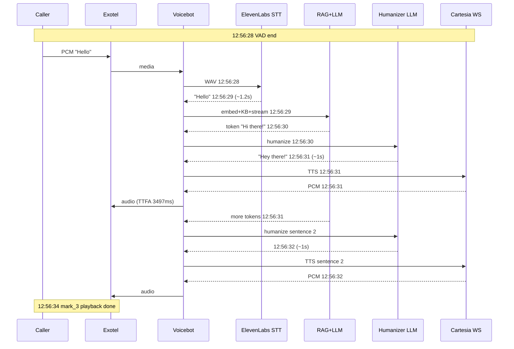

# Cartesia Voicebot Call — Log Timeline & Latency Analysis

**Date of call:** 2026-06-25  
**Customer ID:** `ead34d8f-de23-452c-9091-85b2af98ac82`  
**Stream SID:** `856b7cde0a07cff2c2912d366f311a6p`  
**Call SID:** `0317857b6ab660349bed721e5ed61a6p`  
**Caller:** `08898442005` → `02048555864`  
**Media:** 8 kHz PCM (`pcm_s16le`) — Exotel negotiated `sample_rate: 8000`  
**TTS:** Cartesia `sonic-3.5`, voice `5c32dce6-936a-4892-b131-bafe474afe5f`, emotion `calm`  
**STT:** ElevenLabs (batch)  
**Config signals from logs:** `tts_humanizer_enabled: true`, `rag_streaming_enabled` + `tts_streaming_enabled: true`, `cartesia_emotion_mode` effectively **static** (prompt says *"Do not output emotion metadata"*)  

---

## Table of Contents

1. [Call overview timeline](#1-call-overview-timeline)
2. [Phase A — Connect & greeting](#2-phase-a--connect--greeting)
3. [Phase B — Utterance 1: "Hello"](#3-phase-b--utterance-1-hello)
4. [Phase C — Utterance 2: "Mm-hmm."](#4-phase-c--utterance-2-mm-hmm)
5. [Phase D — Call end & cleanup](#5-phase-d--call-end--cleanup)
6. [Latency summary tables](#6-latency-summary-tables)
7. [Findings & recommended actions](#7-findings--recommended-actions)

---

## 1. Call overview timeline

```
12:56:14  Call connect + greeting pipeline starts
12:56:21  Greeting audio sent to Exotel (~7s after connect)
12:56:23  Greeting playback done (mark_1) — bot listens
12:56:28  User "Hello" captured (VAD)
12:56:32  Bot reply streaming complete (TTFA 3497ms)
12:56:34  Reply playback done (mark_3)
12:56:36  User "Mm-hmm." captured
12:56:38  Exotel stop — call ended by platform
12:56:43  Bot still finishing TTS for utterance 2 (race)
12:56:46  Mark ack fallback warning (marks 4, 5)
```

**Total call duration (WSS active):** ~24 seconds (12:56:14 → 12:56:38)

---

## 2. Phase A — Connect & greeting

| # | Time | Event | Duration from previous | Cumulative from connect |
|---|------|--------|------------------------|-------------------------|
| A1 | `12:56:14` | HTTP GET `/exotel/voicebot/...` — WSS upgrade | — | 0 ms |
| A2 | `12:56:14` | `exotel.in` → `event: start` (8 kHz, base64) | 0 ms | 0 ms |
| A3 | `12:56:14` | `call.started` | 0 ms | 0 ms |
| A4 | `12:56:14` | `call.session_ready` (chat + exotel DB session) | 0 ms | 0 ms |
| A5 | `12:56:14` | `greeting.sending` | 0 ms | 0 ms |
| A6 | `12:56:14` | **Humanizer LLM** request (`gpt-4o-mini`, 350 tokens) — rewrite greeting | 0 ms | 0 ms |
| A7 | `12:56:17` | **Humanizer LLM** response — `"Hi there! How can I help you today?"` | **3,000 ms** | 3 s |
| A8 | `12:56:17` | `tts.start` — Cartesia, 35 chars, emotion `calm`, PCM 8 kHz | 0 ms | 3 s |
| A9 | `12:56:21` | `pipeline.tts.first_chunk` — 2274 bytes from Cartesia | **4,000 ms** | 7 s |
| A10 | `12:56:21` | Multiple `exotel.out.media_batch` — 37,120 PCM bytes total | ~0 ms | 7 s |
| A11 | `12:56:21` | `tts.sent_to_exotel` + `greeting.sent` | 0 ms | 7 s |
| A12 | `12:56:23` | Exotel `mark_1` ack — **playback complete**, inbound buffer cleared | **2,000 ms** | 9 s |

### Phase A breakdown

| Sub-process | Start | End | **Duration** |
|-------------|-------|-----|--------------|
| Session bootstrap (start → session_ready) | 12:56:14 | 12:56:14 | **~0 ms** (same second) |
| Humanizer (OpenAI rewrite before TTS) | 12:56:14 | 12:56:17 | **~3.0 s** |
| Cartesia TTS (tts.start → first_chunk) | 12:56:17 | 12:56:21 | **~4.0 s** (includes WS connect + first synthesis) |
| Cartesia TTS (first_chunk → sent complete) | 12:56:21 | 12:56:21 | **<1 s** |
| Exotel playback (greeting audio) | 12:56:21 | 12:56:23 | **~2.0 s** |
| **Greeting: connect → caller hears start** | 12:56:14 | 12:56:21 | **~7.0 s** |
| **Greeting: connect → bot ready to listen** | 12:56:14 | 12:56:23 | **~9.0 s** |

**Greeting audio length estimate:** 37,120 bytes @ 8 kHz 16-bit mono ≈ **2.32 s** of speech — matches ~2 s playback ack.

---

## 3. Phase B — Utterance 1: "Hello"

| # | Time | Event | Duration from previous | Notes |
|---|------|--------|------------------------|-------|
| B1 | `12:56:23` | `mark_1` — ready for caller speech | — | 5 s listen window starts |
| B2 | `12:56:28` | `vad.timeout_triggered` — 12,480 bytes (~780 ms speech) | **5,000 ms** | VAD end-of-utterance |
| B3 | `12:56:28` | `utterance.received` | 0 ms | |
| B4 | `12:56:28` | `pipeline.stt.request` — ElevenLabs batch | 0 ms | |
| B5 | `12:56:29` | `stt.done` — transcript **"Hello"**, en-IN | **1,000 ms** | Log: `stt_ms: 1186` |
| B6 | `12:56:29` | `pipeline.rag.start` + embedding request | 0 ms | |
| B7 | `12:56:29` | `rag.embedding.done` — 384-dim vector | **<1 s** | Same second |
| B8 | `12:56:29` | `pipeline.rag.kb_hit` — 3 rows, top distance **0.736** (no direct KB; threshold 0.3) | 0 ms | |
| B9 | `12:56:29` | `pipeline.rag.llm_stream` — RAG + Cartesia rules in system prompt | 0 ms | |
| B10 | `12:56:30` | **Humanizer** for streamed chunk `"Hi there!"` | **1 s** | Extra LLM before 1st TTS |
| B11 | `12:56:31` | Humanizer → `"Hey there!"` → `tts.start` (10 chars) | **1,000 ms** | |
| B12 | `12:56:31` | `pipeline.tts.first_chunk` + **`ttfa_ms: 3497`** | **0 ms** | **TTFA over 2 s target** |
| B13 | `12:56:31` | `tts.sent_to_exotel` — 11,520 bytes (sentence 1) | 0 ms | |
| B14 | `12:56:31` | **Humanizer** for `"What can I assist you with today?"` | 0 ms | Parallel with playback |
| B15 | `12:56:32` | Humanizer → `tts.start` (31 chars) | **1,000 ms** | |
| B16 | `12:56:32` | `mark_2` ack — sentence 1 playback done | 0 ms | Overlaps sentence 2 TTS |
| B17 | `12:56:32` | `pipeline.tts.first_chunk` + `tts.sent` — 25,600 bytes (sentence 2) | **0 ms** | Cartesia ~1 s TTFB (warm WS) |
| B18 | `12:56:32` | `rag.llm.done` — full answer: *"Hi there! What can I assist you with today?"* | 0 ms | `cost_usd: 0.00019` |
| B19 | `12:56:32` | `utterance.completed` — **total_ms: 4486** | 0 ms | `spoke_incrementally: true` |
| B20 | `12:56:34` | `mark_3` — full reply playback done | **2,000 ms** | Ready for next utterance |

### Utterance 1 — logged timings (`pipeline.utterance.timing`)

| Metric | Value | Meaning |
|--------|-------|---------|
| `stt_ms` | **1,186 ms** | STT only |
| `ask_pipeline_ms` | **3,300 ms** | Embedding + KB + LLM stream + per-chunk humanizer + Cartesia |
| `final_tts_ms` | **0 ms** | TTS already sent incrementally |
| `total_ms` | **4,486 ms** | VAD end → pipeline complete |
| `ttfa_ms` | **3,497 ms** | User speech end → first outbound audio (**target 2,000 ms — missed**) |

### Utterance 1 — reconstructed critical path

```
VAD end (12:56:28)
  → STT           ~1.2 s
  → Embed + KB    ~0 s (same second)
  → LLM 1st token ~1 s (until humanizer for "Hi there!")
  → Humanizer #1  ~1 s
  → Cartesia #1   ~0 s (first_chunk same second as tts.start)
  → Humanizer #2  ~1 s
  → Cartesia #2   ~1 s
  → LLM complete  (12:56:32)
─────────────────────────────
Total pipeline   ~4.5 s (matches log)
TTFA             ~3.5 s (STT + embed + LLM until first speakable chunk + humanizer + Cartesia)
```

**KB note:** Top match distance 0.736 > direct threshold 0.3 → full LLM path (not kb-direct).

---

## 4. Phase C — Utterance 2: "Mm-hmm."

| # | Time | Event | Duration from previous | Notes |
|---|------|--------|------------------------|-------|
| C1 | `12:56:34` | `mark_3` — ready for speech | — | |
| C2 | `12:56:36` | `vad.timeout_triggered` — 8,640 bytes (~540 ms) | **2,000 ms** | Shorter listen window |
| C3 | `12:56:36` | `utterance.received` | 0 ms | |
| C4 | `12:56:36` | STT request | 0 ms | |
| C5 | `12:56:37` | `stt.done` — **"Mm-hmm."** | **1,000 ms** | Log: `stt_ms: 788` |
| C6 | `12:56:37` | RAG embed + KB hit (top distance **0.811**) | **<1 s** | |
| C7 | `12:56:37` | `pipeline.rag.llm_stream` | 0 ms | |
| C8 | `12:56:38` | **`exotel.in` → `event: stop`** — call ended | **1,000 ms** | Reason: canceled or call ended |
| C9 | `12:56:39` | Humanizer for *"Is there something specific you'd like to know"* | **1 s** | **After call stop** |
| C10 | `12:56:40` | Humanizer → `tts.start` (48 chars) | **1,000 ms** | |
| C11 | `12:56:41` | `pipeline.tts.first_chunk` + **`ttfa_ms: 4517`** | **1,000 ms** | |
| C12 | `12:56:41` | `tts.sent_to_exotel` — 34,560 bytes | 0 ms | |
| C13 | `12:56:42` | Humanizer for *"about?"* | **1 s** | Fragment from stream cut |
| C14 | `12:56:43` | Cartesia TTS + `tts.sent` — 16,640 bytes | **1 s** | |
| C15 | `12:56:43` | `rag.llm.done` + `utterance.completed` — **total_ms: 6358** | 0 ms | |
| C16 | `12:56:38` | WSS `close` code 1006 | — | Abnormal close |

### Utterance 2 — logged timings

| Metric | Value |
|--------|-------|
| `stt_ms` | **788 ms** |
| `ask_pipeline_ms` | **5,569 ms** |
| `total_ms` | **6,358 ms** |
| `ttfa_ms` | **4,517 ms** (over target) |

**Issue:** Exotel sent `stop` at `12:56:38` while the pipeline continued TTS until `12:56:43` — caller likely already hung up; audio may not have been heard.

---

## 5. Phase D — Call end & cleanup

| # | Time | Event | Duration | Notes |
|---|------|--------|----------|-------|
| D1 | `12:56:38` | `event: stop` — sequence 1190 | — | Normal call teardown from Exotel |
| D2 | `12:56:38` | `voicebot: stream stopped` | 0 ms | |
| D3 | `12:56:38` | `WebSocket closed` code **1006** | 0 ms | Abnormal close (no clean close frame) |
| D4 | `12:56:46` | **WARN** — `mark ack missing` for `mark_4`, `mark_5` | +8 s after stop | Fallback cleared pending marks |

Pipeline was still synthesizing when the socket closed; marks 4/5 were never acknowledged.

---

## 6. Latency summary tables

### 6.1 Cartesia TTS per `speakToExotel` invocation

| Invocation | tts.start | first_chunk | **TTFB** | pcm_bytes | text |
|------------|-----------|-------------|----------|-----------|------|
| Greeting | 12:56:17 | 12:56:21 | **~4.0 s** | 37,120 | "Hi there! How can I help you today?" (after humanizer) |
| U1 sentence 1 | 12:56:31 | 12:56:31 | **~0 s*** | 11,520 | "Hey there!" |
| U1 sentence 2 | 12:56:32 | 12:56:32 | **~0 s*** | 25,600 | "What can I help you with today?" |
| U2 sentence 1 | 12:56:40 | 12:56:41 | **~1.0 s** | 34,560 | "Is there something in particular you wanna know?" |
| U2 sentence 2 | 12:56:42 | 12:56:43 | **~1.0 s** | 16,640 | "What's on your mind?" |

\*Same log second; wall-clock likely sub-second on warm WebSocket.

**Pattern:** First Cartesia synthesis in the call (greeting) pays **~4 s** (WebSocket connect + TLS + first context). Later chunks on the same connection are **~0–1 s** TTFB.

### 6.2 Humanizer (OpenAI) calls during call

| Time | Input (approx) | Output | **~Duration** |
|------|----------------|--------|---------------|
| 12:56:14 | Greeting text | "Hi there! How can I help you today?" | **3 s** |
| 12:56:30 | "Hi there!" | "Hey there!" | **1 s** |
| 12:56:31 | "What can I assist you with today?" | "What can I help you with today?" | **1 s** |
| 12:56:39 | "Is there something specific..." | "...you wanna know?" | **1 s** |
| 12:56:41 | "about?" | "What's on your mind?" | **1 s** |

**Total humanizer calls:** 5  
**Estimated humanizer overhead on utterance 1:** ~2 s (two calls before/during first sentences)  
**This is the largest avoidable latency** if `tts_humanizer_enabled = false`.

### 6.3 STT (ElevenLabs batch)

| Utterance | Audio | stt.done lag | Logged `stt_ms` |
|-----------|-------|--------------|-----------------|
| "Hello" | 780 ms | ~1 s | 1,186 ms |
| "Mm-hmm." | 540 ms | ~1 s | 788 ms |

### 6.4 RAG / embedding

| Step | Utterance 1 | Utterance 2 |
|------|-------------|-------------|
| Embedding (`nomic-embed-text`) | <1 s | <1 s |
| KB vector search | <1 s (3 hits) | <1 s (3 hits) |
| LLM stream (`gpt-4o-mini`, max 80 tok) | 12:56:29 → 12:56:32 (**~3 s**) | 12:56:37 → 12:56:43 (**~6 s**, interrupted) |

### 6.5 End-to-end targets

| Metric | Utterance 1 | Utterance 2 | Target |
|--------|-------------|-------------|--------|
| **TTFA** (speech end → first bot audio) | **3,497 ms** | **4,517 ms** | **< 2,000 ms** |
| **Total pipeline** | **4,486 ms** | **6,358 ms** | — |
| Greeting (connect → first audio) | **~7,000 ms** | — | — |

---

## 7. Findings & recommended actions

### 7.1 What is working

| Item | Evidence |
|------|----------|
| Cartesia integrated on live call | `tts_provider: cartesia`, `sonic-3.5` on all TTS stages |
| Direct PCM to Exotel | `output_format: pcm_s16le @ 8000` — no resample logs |
| WebSocket reuse | Greeting ~4 s TTFB; utterance chunks ~0–1 s (warm connection) |
| RAG streaming + sentence TTS | `spoke_incrementally: true`, multiple `tts.start` per answer |
| STT + multilingual | ElevenLabs detected `en-IN` correctly for "Hello" |
| Exotel chunking | `media_chunks` at 3200-byte aligned batches |

### 7.2 Primary latency drivers (this call)

| Rank | Driver | Est. impact | Fix |
|------|--------|-------------|-----|
| 1 | **`tts_humanizer_enabled = true`** — separate OpenAI call **before every** `speakToExotel` chunk | **+1–3 s per sentence** | Set `tts_humanizer_enabled = false` for production; rely on Cartesia + RAG prompt |
| 2 | **First Cartesia TTFB** (cold WS on greeting) | **~4 s** on first synthesis | Pre-connect Cartesia WS at `call.started` before greeting; or cache greeting PCM |
| 3 | **Humanizer on greeting** | **~3 s** before any Cartesia | Disable for greeting or skip humanizer when text is already conversational |
| 4 | **STT batch** | **~0.8–1.2 s** | Expected for ElevenLabs batch; optional streaming STT later |
| 5 | **VAD silence timeout** | **2–5 s** after playback before utterance captured | Tune `vad_silence_timeout_ms` if calls feel sluggish to respond |

### 7.3 Configuration mismatches visible in logs

| Setting | Log evidence | Recommendation |
|---------|--------------|----------------|
| `cartesia_emotion_mode` | System prompt: *"Do not output emotion metadata"*; TTS always `emotion: calm` | If you want LLM-driven emotion, set `cartesia_emotion_mode = 'llm_per_turn'` and update prompt to require `EMOTION:` line |
| Humanizer prompt | Still says *"Output goes to OpenAI text-to-speech"* | Use Cartesia-specific humanizer prompt or disable humanizer |
| Filler `"Mm-hmm."` | Full RAG + 2-sentence TTS fired on acknowledgment | Enable `filler_ack` / treat filler-only transcripts to skip heavy RAG |

### 7.4 Call lifecycle issue

| Issue | Time | Detail |
|-------|------|--------|
| TTS after `stop` | 12:56:38 stop → 12:56:43 TTS complete | Pipeline did not abort when `session.isClosing` / stop received |
| Missing mark ack | 12:56:46 | `mark_4`, `mark_5` pending — caller gone; fallback cleared after 3540 ms |

**Recommendation:** On `event: stop`, set `session.isClosing = true` and cancel in-flight Cartesia contexts / skip new `speakToExotel` calls.

### 7.5 Quick wins SQL (this tenant)

```sql
-- Reduce latency: disable humanizer (saves ~1-3s per spoken chunk)
UPDATE customer_settings
SET tts_humanizer_enabled = FALSE
WHERE customer_id = 'ead34d8f-de23-452c-9091-85b2af98ac82';

-- Optional: enable LLM emotion if desired
UPDATE customer_settings
SET cartesia_emotion_mode = 'llm_per_turn'
WHERE customer_id = 'ead34d8f-de23-452c-9091-85b2af98ac82';
```

After disabling humanizer, **expected TTFA** for utterance 1 drops roughly from **~3.5 s → ~1.5–2.5 s** (STT + embed + first LLM tokens + Cartesia).

---

## Appendix — Mermaid sequence (Utterance 1)



---

*Generated from production logs on 2026-06-25. Re-run analysis after disabling humanizer and retesting TTFA.*
