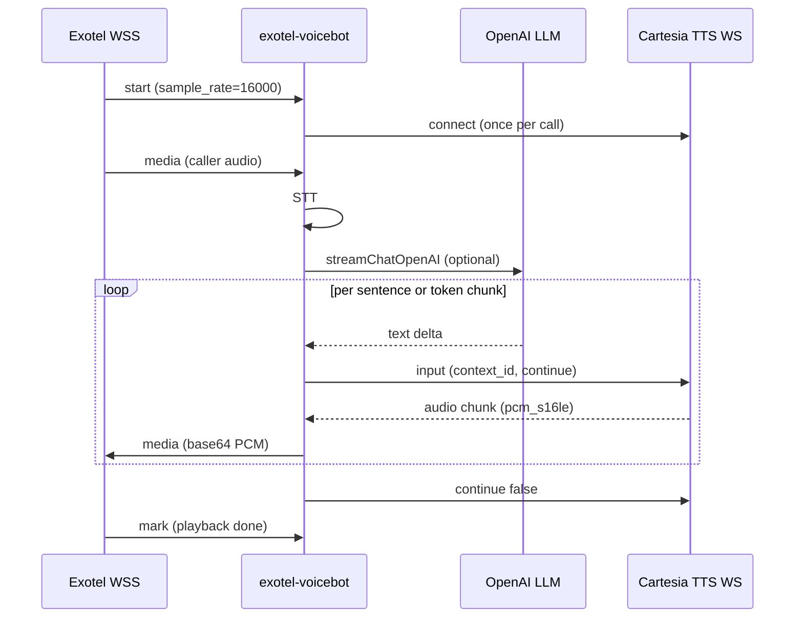
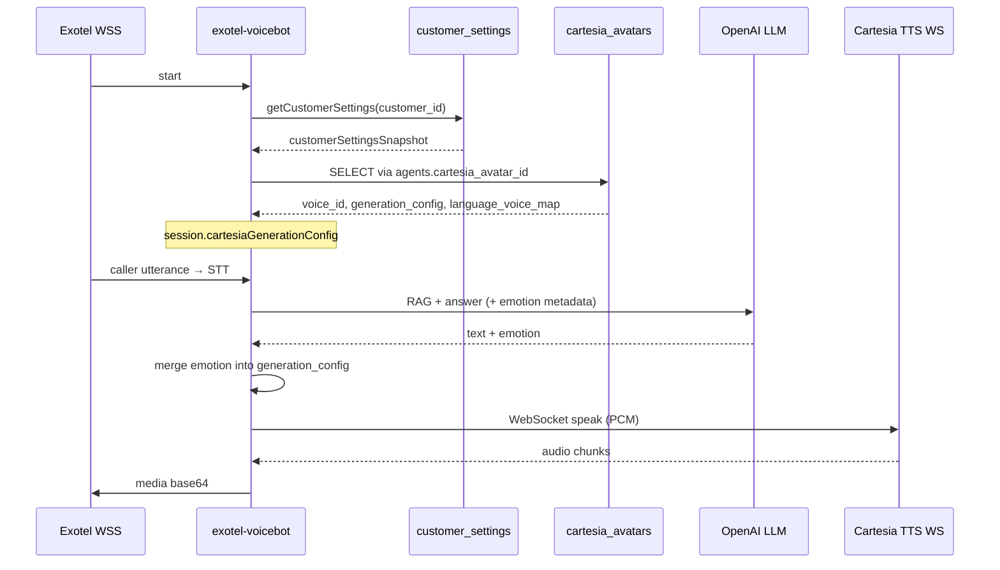

# Cartesia TTS (WebSocket) — Voicebot Integration Plan

**Date:** 2026-06-25  
**Goal:** Add **Cartesia Sonic 3.5** as a production TTS provider for the Exotel voicebot using the **WebSocket** API, with per-customer voice/persona settings, optional humanizer, and minimum latency.  
**Status:** Proposal only — **no code changes until approved**

---

## Table of Contents

1. [Executive Summary](#1-executive-summary)
2. [Current Codebase Structure](#2-current-codebase-structure)
3. [Cartesia API Overview (What We Will Use)](#3-cartesia-api-overview-what-we-will-use)
4. [Exotel Audio Format — Direct PCM Strategy](#4-exotel-audio-format--direct-pcm-strategy)
5. [Real-Time Architecture (Target Design)](#5-real-time-architecture-target-design)
6. [Simulator Settings → Production Mapping](#6-simulator-settings--production-mapping)
7. [LLM & Humanizer Prompt Strategy](#7-llm--humanizer-prompt-strategy)
8. [Per-Customer Configuration Model](#8-per-customer-configuration-model)
   - [8.5 Where settings are stored (per customer)](#85-where-settings-are-stored-per-customer)
   - [8.6 How settings are fetched from the database](#86-how-settings-are-fetched-from-the-database)
   - [8.7 Emotion management (LLM-driven)](#87-emotion-management-llm-driven)
9. [Database Changes (SQL)](#9-database-changes-sql)
10. [Implementation Phases (When Approved)](#10-implementation-phases-when-approved)
11. [Latency & Quality Targets](#11-latency--quality-targets)
12. [Risks & Mitigations](#12-risks--mitigations)
13. [Testing Checklist](#13-testing-checklist)
14. [Reference Links](#14-reference-links)

---

## 1. Executive Summary

### Why Cartesia + WebSocket (not Bytes)

| Endpoint | Fit for Convixx voicebot |
|----------|--------------------------|
| **WebSocket** `/tts/websocket` | **Recommended.** One connection per phone call amortizes TCP/TLS; supports streaming LLM output via [continuations](https://docs.cartesia.ai/use-the-api/tts-websocket/contexts); lowest time-to-first-audio across many turns. |
| Bytes `POST /tts/bytes` | Already used in simulator. Fine for one-shot synthesis; pays full connect cost every `speakToExotel()` call. |
| SSE `POST /tts/sse` | Timestamps on HTTP; heavier wire format (JSON + base64 chunks). No continuations. Not needed for telephony. |

The voicebot already keeps an **Exotel WebSocket open for the whole call**. Cartesia should mirror that: **one Cartesia TTS WebSocket per `VoicebotSession`**, reused for greeting, filler acks, RAG answers, and campaign scripts.

### Why Sonic 3.5

Per [Cartesia Sonic 3.5 docs](https://docs.cartesia.ai/build-with-cartesia/tts-models/latest):

- Sub-90 ms model latency, ranked for naturalness
- **42 languages** including Hindi, Marathi, Tamil, Telugu, Bengali, Gujarati, Kannada, Malayalam, Punjabi — aligns with existing multilingual voicebot
- Native handling of numbers, codes, heteronyms — less preprocessing
- Default production model ID: **`sonic-3.5`** (auto-updates to latest stable snapshot); pin with `sonic-3.5-2026-05-04` if a customer needs frozen behavior

### End result we are optimizing for

```
Caller speaks → STT → LLM (optionally streaming) → Cartesia WS (PCM s16le @ Exotel rate) → PcmChunkBuffer → Exotel media
```

**No WAV/MP3 decode, no resampling** when Exotel negotiates 8 kHz / 16 kHz / 24 kHz and we request the same rate from Cartesia.

---

## 2. Current Codebase Structure

### 2.1 TTS provider pattern (today)

There is **no provider interface/registry**. Production routing is imperative inside `speakToExotel()` in `apps/api/src/routes/exotel-voicebot.ts`:

```
tts_provider === "elevenlabs"  → elevenlabs.ts (HTTP /stream incremental)
else                           → sarvam.ts (REST + HTTP stream incremental)
```

Types and DB only allow `"sarvam" | "elevenlabs"` (`customer-settings.ts`, migration `005`).

### 2.2 Cartesia (today — simulator only)

| File | Role |
|------|------|
| `apps/api/src/services/cartesia.ts` | REST client → `POST /tts/bytes`; models, voices, emotions, output presets, cost estimates |
| `apps/api/src/routes/cartesia-simulator.ts` | Dev simulator: STT → optional humanizer → Cartesia bytes TTS |
| `apps/api/src/routes/cartesia-voice-browser.ts` | Voice search + preview |
| `apps/api/src/config/env.ts` | `CARTESIA_API_KEY`, `CARTESIA_USD_PER_MILLION_CREDITS` |

**Cartesia is not connected to Exotel voicebot or `customer_settings.tts_provider`.**

### 2.3 Voice persona resolution chain

```
customer_settings (tenant defaults)
    ↓
agents.avatar_id          → avatars (Sarvam fields)
agents.elevenlabs_avatar_id → elevenlabs_avatars (ElevenLabs fields)
    ↓
voice-persona.ts → VoicebotSession (ttsSpeaker, ttsModel, elevenlabsVoiceSettings, …)
    ↓
speakToExotel()
```

ElevenLabs has a dedicated `elevenlabs_avatars` table (migration `007`). Cartesia needs an equivalent.

### 2.4 Real-time pipeline (Exotel)

```
Exotel WSS media (PCM base64 in)
  → VAD → STT (Sarvam or ElevenLabs)
  → runVoicebotReplyPipelineAfterTranscriptReady
  → runVoicebotAskPipeline (RAG + LLM)
  → TTS:
       if rag_streaming_enabled && tts_streaming_enabled:
         createStreamingVoiceTts() — sentence cuts → speakToExotel() per chunk
       else:
         speakToExotel() once with full answer
  → sendAudioToExotel() — PcmChunkBuffer (320-byte aligned, 3.2–100 KB)
  → Exotel WSS media (PCM base64 out)
```

`createStreamingVoiceTts()` already buffers LLM tokens and speaks per sentence (~100 chars). This is **custom buffering** in Cartesia terms — we should pair it with **`max_buffer_delay_ms: 0`** on the WebSocket so Cartesia does not add another 3 s wait on top of our sentence aggregator.

### 2.5 Exotel PCM requirements (from `pcm-audio.ts` + `EXOTEL_VOICEBOT_WEBSOCKET_SPEC.md`)

| Property | Value |
|----------|-------|
| Encoding | **16-bit signed PCM, mono, little-endian** (`slin`) |
| Sample rate | Negotiated per call: **8000, 16000, or 24000** Hz |
| Transport | Base64 in JSON `media.payload` |
| Chunk rules | Multiple of **320 bytes**; min **3200 B**; max **99840 B** |

Sarvam incremental path already requests `linear16` at `exotelRate`. ElevenLabs requests `pcm_{rate}` when streaming. Cartesia should follow the same pattern.

---

## 3. Cartesia API Overview (What We Will Use)

### 3.1 Connection

```
wss://api.cartesia.ai/tts/websocket
```

Headers (server-side Node.js):

```
Authorization: Bearer <CARTESIA_API_KEY>
Cartesia-Version: 2026-03-01
```

Already aligned with `CARTESIA_VERSION` in `cartesia.ts`.

### 3.2 WebSocket message flow (per utterance)

1. Open WS once per call (or lazily on first TTS).
2. For each spoken line, create a **`context_id`** (UUID).
3. Send JSON input message(s):

```json
{
  "model_id": "sonic-3.5",
  "transcript": "Hi there! ",
  "voice": { "mode": "id", "id": "f786b574-daa5-4673-aa0c-cbe3e8534c02" },
  "language": "en",
  "output_format": {
    "container": "raw",
    "encoding": "pcm_s16le",
    "sample_rate": 16000
  },
  "generation_config": {
    "speed": 1.0,
    "volume": 1.0,
    "emotion": "neutral"
  },
  "context_id": "<uuid>",
  "continue": true
}
```

4. Final chunk: `"continue": false` (or empty transcript + `continue: false` if end is unknown).
5. Receive events: `chunk` (binary/audio), `done`, `error` (structured JSON on version ≥ 2026-03-01).
6. Pipe PCM chunks immediately to `sendAudioToExotel()`.

### 3.3 Continuations vs our sentence splitter

| Mode | When | How |
|------|------|-----|
| **Single message** | Full text known (greeting, error, campaign script, non-streaming RAG) | One WS message, `continue: false` |
| **Multi-message continuation** | RAG streaming — LLM tokens arrive incrementally | Same `context_id`, `continue: true` on partials, `false` on last; spaces preserved between chunks |
| **Sentence-level (current pattern)** | `createStreamingVoiceTts` cuts at `.?!` | New `context_id` per sentence; simpler barge-in cancellation |

**Recommendation:** Phase 1 implements **sentence-level** (reuse `createStreamingVoiceTts`) — minimal change to `exotel-voicebot.ts`. Phase 2 adds **true LLM→Cartesia continuation** on one context per assistant turn for even lower latency inside long answers.

### 3.4 Buffering (critical for latency)

From [Cartesia buffering guide](https://docs.cartesia.ai/use-the-api/tts-websocket/buffering):

| Mode | `max_buffer_delay_ms` | Use in Convixx |
|------|----------------------|----------------|
| Managed (Cartesia aggregates) | Default ~3000 | **Do not use** alongside our sentence splitter — double latency |
| Custom (we aggregate) | **0** | **Use this** — we already cut at sentences in `createStreamingVoiceTts` |

Rules:

- End sentences with `.`, `?`, or `!` before sending (Cartesia + our cutter already do this).
- Always signal end with `continue: false`.
- Contexts expire ~1 s after last audio — do not reuse `context_id` across unrelated utterances.

### 3.5 Generation config (Sonic 3.5)

Already validated in simulator (`cartesia.ts`):

| Field | Range | Simulator default |
|-------|-------|-------------------|
| `speed` | 0.6 – 1.5 | 1.0 |
| `volume` | 0.5 – 2.0 | 1.0 |
| `emotion` | 50+ values (`neutral`, `calm`, `sympathetic`, …) | `neutral` |

Emotion can also change mid-context on a later `continue: true` chunk (advanced; not required for v1).

### 3.6 Featured agent voices (starting points)

From [Sonic 3.5 voice selection](https://docs.cartesia.ai/build-with-cartesia/tts-models/latest):

| Name | Voice ID | Locale |
|------|----------|--------|
| Katie | `f786b574-daa5-4673-aa0c-cbe3e8534c02` | en-US female |
| Skylar | `db6b0ed5-d5d3-463d-ae85-518a07d3c2b4` | en-US female |
| Jameson | `a5136bf9-224c-4d76-b823-52bd5efcffcc` | en-US male |
| Gemma | `62ae83ad-4f6a-430b-af41-a9bede9286ca` | en-GB female |
| Archie | `ef191366-f52f-447a-a398-ed8c0f2943a1` | en-GB male |

Customers pick voices via `cartesia_avatars` or tenant default `tts_default_speaker` (repurposed as Cartesia `voice_id`).

---

## 4. Exotel Audio Format — Direct PCM Strategy

### 4.1 Cartesia output options ([output format guide](https://docs.cartesia.ai/build-with-cartesia/capability-guides/tts-output-audio-format))

| Encoding | Sample rates | Telephony note |
|----------|--------------|----------------|
| `pcm_mulaw` | 8000 | G.711 μ-law — Twilio NA/Japan |
| `pcm_alaw` | 8000 | G.711 A-law — EU/international PSTN |
| **`pcm_s16le`** | 8000, 16000, 22050, 24000, 44100, 48000 | **Matches Exotel `slin`** |
| `pcm_f32le` | 44100, 48000 | Web Audio API — not for Exotel |

**Exotel expects linear PCM (`slin`), not μ-law/A-law in the WebSocket payload.** Do **not** use `pcm_mulaw` / `pcm_alaw` for Exotel integration even though Cartesia documents them for Twilio.

### 4.2 Recommended `output_format` per Exotel negotiation

| Exotel `media_format.sample_rate` | Cartesia request | Resample needed? |
|-----------------------------------|------------------|------------------|
| 8000 | `raw` + `pcm_s16le` + `8000` | **No** |
| 16000 | `raw` + `pcm_s16le` + `16000` | **No** |
| 24000 | `raw` + `pcm_s16le` + `24000` | **No** |

Function (conceptual): `cartesiaOutputFormatForExotel(exotelRate)` — mirror `elevenLabsTtsOutputFormatForTelephony()`.

### 4.3 Quality note: 8 kHz vs 16 kHz

- Many Exotel deployments default to **8 kHz** (PSTN bandwidth).
- Cartesia at 8 kHz is still intelligible; **16 kHz Exotel stream** (if tenant/bootstrap supports it) gives noticeably better TTS quality with zero extra resampling cost.
- Document per-customer recommendation: prefer `sample-rate=16000` in voicebot bootstrap URL when Exotel account allows it.

### 4.4 What we avoid

| Anti-pattern | Cost |
|--------------|------|
| `mp3` / `wav` container from Cartesia | Decode + strip header + resample |
| Generate at 44100, resample to 8000 | CPU + quality loss (same issue as ElevenLabs 22050→8000) |
| Default `max_buffer_delay_ms` + sentence splitter | Up to 3 s extra wait per chunk |

---

## 5. Real-Time Architecture (Target Design)

### 5.1 Session-scoped Cartesia connection



### 5.2 New service module (planned)

`apps/api/src/services/cartesia-tts-ws.ts` (name TBD when coding):

| Responsibility |
|----------------|
| `CartesiaTtsSession` — wraps one WS per voicebot call |
| `connect()` / `close()` on call start/end |
| `speak(text, opts)` — single utterance, returns async generator of PCM buffers |
| `speakIncremental(contextId, chunk, continue)` — continuations |
| `cancelContext(contextId)` — barge-in |
| Structured error handling (`error_code`, `concurrency_limited`) |
| Reconnect with backoff if WS drops mid-call |

### 5.3 Integration points in `exotel-voicebot.ts`

| Hook | Change |
|------|--------|
| Session `start` | Create `session.cartesiaTts` if `tts_provider === 'cartesia'` |
| `speakToExotel()` | New branch before Sarvam fallback |
| `createStreamingVoiceTts()` | No structural change; Cartesia benefits from per-sentence calls on shared WS |
| `sendAudioToExotel()` | Unchanged — already handles raw PCM |
| Barge-in | Cancel active Cartesia `context_id`; optionally send cancel message per Cartesia WS API |
| Session `stop` / `close` | Close Cartesia WS |

### 5.4 Humanizer in production path (optional per customer)

Simulator flow (`cartesia-simulator.ts`):

```
source text → [optional humanizeTextForOpenAiTts] → cartesiaTextToSpeech (bytes)
```

Production proposal:

```
LLM answer text → [optional humanizer if tts_humanizer_enabled] → Cartesia WS
```

**Latency trade-off:** Humanizer adds one LLM round-trip (~200–800 ms). Default **`tts_humanizer_enabled = false`** for production; enable for premium personas where naturalness > speed.

When disabled, rely on:

1. Main RAG/LLM system prompt (Cartesia-aware formatting + emotion metadata — §7, §8.7)
2. Cartesia Sonic native expressiveness (`generation_config` merged from avatar + LLM emotion)

### 5.5 Concurrency

Cartesia enforces plan concurrency limits (`concurrency_limited` error). `customer_settings.max_concurrent_calls` should stay within Cartesia plan. Consider a server-side semaphore keyed by Cartesia API key.

---

## 6. Simulator Settings → Production Mapping

Settings used in `cartesia-simulator.ts` / `cartesiaSimulatorDefaults()`:

| Simulator field | Production storage | Notes |
|-----------------|-------------------|-------|
| `model_id` | `customer_settings.tts_model` or `cartesia_avatars.model_id` | Default `sonic-3.5` |
| `voice_id` | `cartesia_avatars.voice_id` / `tts_default_speaker` | Required |
| `language` | Derived from `session.currentLanguageCode` → ISO 639-1 (`hi`, `en`, …) | Map from BCP-47 |
| `gen_speed` | `cartesia_avatars.generation_config.speed` or tenant JSON | 0.6–1.5 |
| `gen_volume` | `generation_config.volume` | 0.5–2.0 |
| `gen_emotion` | `cartesia_avatars.generation_config.emotion` (base/fallback) | In prod with `llm_per_turn`, LLM overrides per reply (§8.7); simulator sets manually |
| `pronunciation_dict_id` | `cartesia_avatars.pronunciation_dict_id` | Optional |
| `legacy_speed` | `cartesia_avatars.legacy_speed` | `slow`/`normal`/`fast` — Sonic 3 legacy; omit for 3.5 |
| `is_pvc_voice` | `cartesia_avatars.is_pvc_voice` | Affects billing estimate only |
| `output_preset` | **Not customer-configurable** | Always derive from Exotel rate (§4) |
| `skip_humanizer` | `customer_settings.tts_humanizer_enabled` (inverted) | Default off in prod |
| `humanizer_system_prompt` | `customer_settings.tts_humanizer_system_prompt` | Text, nullable |
| Humanizer style fields | `customer_settings.tts_humanizer_style` JSONB | See `HumanizerStyleSettings` |
| `llm_model` / `llm_temperature` | Existing `openai_model`, `llm_temperature` | Humanizer only |
| `llm_max_tokens` | `customer_settings.tts_humanizer_max_tokens` | New; default 350 |

Sarvam-specific columns (`tts_default_pitch`, `tts_default_loudness`, `tts_output_codec`) are **ignored** when `tts_provider = 'cartesia'`.

---

## 7. LLM & Humanizer Prompt Strategy

### 7.1 Two prompt layers

| Layer | Purpose | When it runs |
|-------|---------|--------------|
| **A. Main voicebot / RAG system prompt** | Shape LLM *answers* for spoken delivery | Every turn |
| **B. Humanizer system prompt** | Rewrite LLM text into phone-natural speech | Only if `tts_humanizer_enabled` |

Cartesia does **not** use ElevenLabs audio tags (`[happy]`). Emotion is set via `generation_config.emotion`, not inline markup.

### 7.2 Cartesia prompting tips → main LLM system prompt addendum

Based on [Cartesia prompting tips](https://docs.cartesia.ai/build-with-cartesia/capability-guides/prompting-tips) — append to existing voicebot system prompt when `tts_provider = 'cartesia'`:

```
SPOKEN OUTPUT RULES (text will be sent to Cartesia Sonic TTS):
- Write natural, well-punctuated sentences. End every sentence with . ? or !
- Use complete phrases — do not output lone numbers, codes, or bullet lines.
- Use normal capitalization; avoid ALL CAPS except acronyms meant to be spelled (USA).
- Write numbers, dates, currency, and times in conventional form (Rs 1,500, 3 PM, 12/06/2026).
- For confirmation codes or IDs, include surrounding words: "Your confirmation code is A B C 1 2 3."
  If the stack supports spell tags, use <spell>ABC123</spell>; otherwise space characters: "A B C 1 2 3".
- Use commas and periods for pauses — no SSML, no markdown, no bullet lists, no URLs.
- Keep replies concise for phone calls — short sentences, one idea each.
- Do not add emotion tags or stage directions in the spoken text; emotion is passed separately (see §8.7).
- Match the conversation language; Sonic handles Hindi and Indian languages natively.
```

When `cartesia_emotion_mode = 'llm_per_turn'` (recommended), also append:

```
EMOTION METADATA (required when emotion mode is llm_per_turn):
- After your spoken answer, on its own line, output exactly: EMOTION: <one_word>
- <one_word> must be one of the allowed emotions for this tenant (see system context).
- Choose emotion from conversation context (e.g. sympathetic for complaints, enthusiastic for good news, apologetic for errors).
- Examples: EMOTION: sympathetic | EMOTION: calm | EMOTION: enthusiastic
- The EMOTION line is stripped before TTS; never speak it aloud.
```

Alternative (preferred at implementation time): use **structured JSON** from the LLM (`{ "answer": "...", "emotion": "sympathetic" }`) instead of a trailing `EMOTION:` line — same semantics, easier parsing.

### 7.3 Humanizer prompt adaptation for Cartesia

Reuse `openai-tts-humanizer.ts` but ship a **Cartesia-specific default** (`DEFAULT_CARTESIA_HUMANIZER_SYSTEM_PROMPT`):

- Replace "Output goes to OpenAI text-to-speech" → "Output goes to Cartesia Sonic TTS"
- Remove references to OpenAI delivery instructions / audio tags
- Keep phone-call rewrite rules (contractions, warmth, no "Please be advised")
- Preserve `HumanizerStyleSettings` block (`buildHumanizerStyleBlock`)
- `scenario: live_phone_call` and `speaking_pace: natural_conversational` remain good defaults

`HUMANIZER_PROMPT_VERSION` should bump when this prompt ships so simulators reset stale localStorage.

### 7.4 When humanizer is off (recommended default)

Sonic 3.5 is designed to read transcript as-is. The main LLM addendum (§7.2) is sufficient for most tenants. Enable humanizer only when:

- LLM outputs overly formal/written prose despite prompt tuning
- Customer pays for extra quality and accepts +300–800 ms latency

---

## 8. Per-Customer Configuration Model

> **Note:** These tables/columns do not exist in production yet — they are defined in migration `008` (§9). Today Cartesia settings exist only in the simulator (request-time form fields, not persisted per customer).

### 8.1 Resolution order (same pattern as ElevenLabs)

```
customer_settings (tenant defaults + emotion mode)
    ↓
agents.cartesia_avatar_id → cartesia_avatars row
    ↓ language_voice_map[lang] overrides voice_id, model_id, generation_config
    ↓
session fields: ttsSpeaker, ttsModel, cartesiaGenerationConfig (speed/volume/base emotion)
    ↓
LLM per-turn emotion (runtime — not stored in DB)
    ↓
merged generation_config → Cartesia WebSocket TTS
    ↓
cartesiaOutputFormatForExotel(session.mediaFormat.sample_rate)
```

### 8.2 Tenant-level toggles (`customer_settings`)

One row per customer. Loaded once per call into `session.customerSettingsSnapshot`.

| Column | Purpose |
|--------|---------|
| `tts_provider` | Set to `'cartesia'` to enable Cartesia |
| `tts_model` | Default model, e.g. `sonic-3.5` |
| `tts_default_speaker` | Fallback Cartesia `voice_id` when agent has no avatar |
| `tts_streaming_enabled` | WS streaming path (default **true** for Cartesia) |
| `rag_streaming_enabled` | Pair with TTS streaming for lowest latency |
| `tts_humanizer_enabled` | Optional LLM rewrite before TTS (+latency) |
| `tts_humanizer_system_prompt` | Custom humanizer system prompt (nullable) |
| `tts_humanizer_style` | JSONB — `HumanizerStyleSettings` (warmth, pace, fillers, …) |
| `tts_humanizer_max_tokens` | Cap humanizer output (default 350) |
| `cartesia_max_buffer_delay_ms` | Cartesia WS buffering — use **0** with our sentence splitter |
| `cartesia_emotion_mode` | How emotion is chosen: `static` \| `llm_per_turn` \| `llm_per_sentence` (see §8.7) |
| `cartesia_allowed_emotions` | `TEXT[]` allowlist for LLM-chosen emotions; invalid values fall back |

Sarvam-specific columns (`tts_default_pitch`, `tts_default_loudness`, `tts_output_codec`) are **ignored** when `tts_provider = 'cartesia'`.

### 8.3 Avatar-level (`cartesia_avatars`)

Many rows per customer — reusable voice personas (mirrors `elevenlabs_avatars`).

| Column | Purpose |
|--------|---------|
| `voice_id` | Cartesia voice UUID (required) |
| `model_id` | e.g. `sonic-3.5` |
| `generation_config` | JSONB: `{ "speed": 1, "volume": 1, "emotion": "neutral" }` — **base/fallback** emotion |
| `pronunciation_dict_id` | Optional Cartesia pronunciation dictionary |
| `legacy_speed` | Optional `slow` \| `normal` \| `fast` (Sonic 3 legacy) |
| `is_pvc_voice` | Billing estimate flag (~1.5× credits) |
| `language_voice_map` | Per BCP-47 overrides — see example below |
| `is_default` | One default avatar per customer |
| `is_active` | Soft-delete / disable persona |

**`language_voice_map` example:**

```json
{
  "hi-IN": {
    "voice_id": "db6b0ed5-d5d3-463d-ae85-518a07d3c2b4",
    "model_id": "sonic-3.5",
    "generation_config": { "speed": 1, "volume": 1, "emotion": "calm" }
  },
  "en-IN": {
    "generation_config": { "emotion": "sympathetic" }
  }
}
```

### 8.4 Agent-level (`agents`)

| Column | Purpose |
|--------|---------|
| `cartesia_avatar_id` | FK → `cartesia_avatars.id` — which persona this agent uses |

Same pattern as `agents.elevenlabs_avatar_id`.

### 8.5 Where settings are stored (per customer)

Settings are split across **three database layers**. Nothing is stored per phone call — call-time emotion is computed at runtime (§8.7).

```text
┌─────────────────────────────────────────────────────────────┐
│ Layer A: customer_settings (1 row / customer)               │
│  Tenant-wide: tts_provider, tts_model, streaming flags,     │
│  humanizer_*, cartesia_max_buffer_delay_ms,                 │
│  cartesia_emotion_mode, cartesia_allowed_emotions           │
└──────────────────────────┬──────────────────────────────────┘
                           │
┌──────────────────────────▼──────────────────────────────────┐
│ Layer B: cartesia_avatars (many rows / customer)            │
│  Per persona: voice_id, model_id, generation_config,        │
│  pronunciation_dict_id, language_voice_map                  │
└──────────────────────────┬──────────────────────────────────┘
                           │
┌──────────────────────────▼──────────────────────────────────┐
│ Layer C: agents.cartesia_avatar_id                          │
│  Links each agent to one cartesia_avatars row               │
└──────────────────────────┬──────────────────────────────────┘
                           │
┌──────────────────────────▼──────────────────────────────────┐
│ Runtime (not in DB): LLM emotion per turn/sentence          │
│  Merged into generation_config at speakToExotel() time      │
└─────────────────────────────────────────────────────────────┘
```

**What is NOT stored in the database:**

| Data | Where it lives |
|------|----------------|
| Per-turn LLM emotion | Parsed from LLM response → `session.cartesiaTurnEmotion` or passed into `speakToExotel()` |
| Cartesia WebSocket connection | `VoicebotSession` for duration of call |
| Output PCM format | Derived from `session.mediaFormat.sample_rate` (Exotel negotiation) |
| Simulator form fields | Request-time only (today); production uses DB layers above |

**Priority when values conflict:**

1. `language_voice_map[call language]` overrides avatar defaults
2. Avatar overrides `customer_settings` fallbacks for voice/model/generation_config
3. LLM emotion overrides avatar `generation_config.emotion` when `cartesia_emotion_mode` is not `static`
4. `customer_settings.tts_default_speaker` / `tts_model` used only when no avatar or missing fields

### 8.6 How settings are fetched from the database

Follows the **same pattern as ElevenLabs today** — two DB reads at call setup, then session-only on the hot path.

#### Step 1 — Call connect / Exotel `start`

`getCustomerSettings(customerId)` in `apps/api/src/services/customer-settings.ts`:

```sql
SELECT * FROM customer_settings WHERE customer_id = $1
```

- Short in-memory cache (~TTL) avoids repeated queries.
- Called from `applyCustomerVoiceSettingsToSession()` in `exotel-voicebot.ts`.
- Result stored on **`session.customerSettingsSnapshot`** for the whole call.

Fields copied to session include: `tts_streaming_enabled` → `session.ttsStreamingForVoice`, `rag_streaming_enabled`, `llm_temperature`, humanizer flags, `cartesia_emotion_mode`, etc.

#### Step 2 — Agent persona (when `session.agentId` is known)

Extend `applyAgentVoicePersonaToSession()` in `apps/api/src/services/voice-persona.ts` (mirrors ElevenLabs block):

```sql
-- 2a. Which avatar does this agent use?
SELECT cartesia_avatar_id FROM agents
WHERE id = $1 AND customer_id = $2;

-- 2b. Load persona (only when tts_provider = 'cartesia' and cartesia_avatar_id IS NOT NULL)
SELECT voice_id, model_id, generation_config, pronunciation_dict_id,
       legacy_speed, is_pvc_voice, language_voice_map
FROM cartesia_avatars
WHERE id = $1 AND customer_id = $2 AND is_active = TRUE;
```

Then:

1. Pick call language via `pickLang(session)` (BCP-47, e.g. `hi-IN`).
2. Merge `language_voice_map[lang]` over avatar row defaults (`mergeLanguageMapEntry` — reuse existing helper).
3. Write to session:
   - `session.ttsSpeaker` ← `voice_id`
   - `session.ttsModel` ← `model_id`
   - `session.cartesiaGenerationConfig` ← merged `{ speed, volume, emotion }`
   - `session.cartesiaPronunciationDictId` ← optional
   - `session.cartesiaLegacySpeed` ← optional

**Fallback when no avatar:** use `customer_settings.tts_default_speaker` + `tts_model` + default `generation_config` `{ speed: 1, volume: 1, emotion: "neutral" }`.

#### Step 3 — At TTS time (`speakToExotel`)

**No additional DB queries** on the hot path (unless language switch re-runs persona merge).

Read from session:

| Source | Used for |
|--------|----------|
| `tenantCs(session)` | humanizer on/off, `cartesia_max_buffer_delay_ms`, emotion mode |
| `session.ttsSpeaker`, `session.ttsModel` | Cartesia `voice`, `model_id` |
| `session.cartesiaGenerationConfig` | speed, volume, **base** emotion |
| `session.cartesiaTurnEmotion` (or arg) | **LLM emotion** for this utterance |
| `session.mediaFormat.sample_rate` | `output_format` PCM rate |

Admin/API updates use `getCustomerSettings()` + settings routes (`routes/settings.ts`); planned `cartesia_avatars` CRUD for persona management.

#### Sequence diagram



### 8.7 Emotion management (LLM-driven)

Cartesia Sonic does **not** use inline emotion tags in transcript text (unlike ElevenLabs `[happy]`). Emotion is sent as **`generation_config.emotion`** on the WebSocket input message. Cartesia also supports **changing emotion mid-context** on a later `continue: true` chunk (Phase 2 / `llm_per_sentence`).

#### Two sources of emotion

| Source | Stored in DB? | Role |
|--------|---------------|------|
| **Avatar / tenant base** | Yes — `cartesia_avatars.generation_config.emotion` (and overrides in `language_voice_map`) | Default persona tone, e.g. support agent always starts `sympathetic` |
| **LLM per turn** | **No** — runtime only | Dynamic tone from conversation context |

#### `cartesia_emotion_mode` (tenant setting)

| Mode | Behavior |
|------|----------|
| `static` | Always use avatar/tenant `generation_config.emotion`; LLM does not choose |
| `llm_per_turn` | **Recommended.** LLM picks one emotion per assistant reply; same emotion for all sentences in that reply |
| `llm_per_sentence` | LLM picks emotion per sentence (Phase 2); uses Cartesia WS emotion change on continuation chunks |

Default for new Cartesia tenants: **`llm_per_turn`**.

#### How the LLM provides emotion

**Option A — Structured JSON response (preferred at implementation):**

```json
{
  "answer": "I understand — let me check that order for you right away.",
  "emotion": "sympathetic"
}
```

**Option B — Trailing metadata line** (simpler prompt, matches §7.2):

```text
I understand — let me check that order for you right away.
EMOTION: sympathetic
```

Parser strips `EMOTION:` line before TTS. Never sent to Cartesia as spoken text.

**Option C — Humanizer returns emotion** (when `tts_humanizer_enabled = true`):

Extend humanizer to return `{ humanized_text, emotion }` so one extra LLM call covers rewrite + emotion. Useful when humanizer is already on; not required when humanizer is off.

#### Merge rule at `speakToExotel()`

```typescript
// Conceptual — not implemented yet
function resolveCartesiaGenerationConfigForUtterance(
  session: VoicebotSession,
  llmEmotion?: string | null
): CartesiaGenerationConfig {
  const base = session.cartesiaGenerationConfig ?? { speed: 1, volume: 1, emotion: "neutral" };
  const mode = tenantCs(session)?.cartesia_emotion_mode ?? "llm_per_turn";
  const allowed = tenantCs(session)?.cartesia_allowed_emotions ?? CARTESIA_EMOTIONS;

  let emotion = base.emotion ?? "neutral";
  if (mode !== "static" && llmEmotion) {
    const normalized = resolveCartesiaEmotion(llmEmotion); // existing helper in cartesia.ts
    if (allowed.includes(normalized)) {
      emotion = normalized;
    }
  }
  return { speed: base.speed, volume: base.volume, emotion };
}
```

**Fallback chain:** LLM emotion (if valid + mode allows) → avatar `generation_config.emotion` → `"neutral"`.

#### `cartesia_allowed_emotions` (guardrail)

Tenant allowlist prevents LLM from picking inappropriate emotions. Example default for support:

```sql
ARRAY['neutral','calm','sympathetic','content','grateful','apologetic','enthusiastic','curious']::TEXT[]
```

Must be values from `CARTESIA_EMOTIONS` in `cartesia.ts`. Invalid LLM output → fall back to avatar base emotion (log warning).

#### Emotion vs humanizer `emotion_intensity`

| Field | Layer | Purpose |
|-------|-------|---------|
| `generation_config.emotion` | Cartesia TTS API | Sonic delivery emotion (`sympathetic`, `calm`, …) |
| `tts_humanizer_style.emotion_intensity` | Humanizer LLM only | How strongly to rewrite prose (`high`, `theatrical`, …) — does not map 1:1 to Cartesia emotions |

These are independent. Humanizer shapes *wording*; Cartesia emotion shapes *voice delivery*.

#### Phase 2: per-sentence emotion (`llm_per_sentence`)

When RAG streaming cuts sentences via `createStreamingVoiceTts()`:

1. Each sentence may carry its own `emotion` from LLM (structured stream or classifier).
2. First WS chunk for context: base `generation_config`.
3. Later chunks on same `context_id`: `generation_config: { emotion: "..." }` only on the chunk where emotion changes (Cartesia supports mid-context emotion updates).

Only needed if per-turn emotion is not expressive enough; adds complexity.

---

## 9. Database Changes (SQL)

Migration file (when coding): `infra/postgres/migrations/008_cartesia_avatars.sql`

### 9.1 Extend `tts_provider` enum (customer_settings + avatars)

```sql
-- customer_settings: allow cartesia
ALTER TABLE customer_settings
  DROP CONSTRAINT IF EXISTS customer_settings_tts_provider_check;

ALTER TABLE customer_settings
  ADD CONSTRAINT customer_settings_tts_provider_check
  CHECK (tts_provider IN ('sarvam', 'elevenlabs', 'cartesia'));

-- avatars: allow cartesia (for generic avatar rows if ever used)
ALTER TABLE avatars
  DROP CONSTRAINT IF EXISTS avatars_tts_provider_check;

ALTER TABLE avatars
  ADD CONSTRAINT avatars_tts_provider_check
  CHECK (tts_provider IN ('sarvam', 'elevenlabs', 'cartesia'));
```

### 9.2 Tenant-level Cartesia + humanizer columns

```sql
ALTER TABLE customer_settings
  ADD COLUMN IF NOT EXISTS tts_humanizer_enabled BOOLEAN NOT NULL DEFAULT FALSE,
  ADD COLUMN IF NOT EXISTS tts_humanizer_system_prompt TEXT,
  ADD COLUMN IF NOT EXISTS tts_humanizer_style JSONB NOT NULL DEFAULT '{}'::jsonb,
  ADD COLUMN IF NOT EXISTS tts_humanizer_max_tokens INT NOT NULL DEFAULT 350
    CHECK (tts_humanizer_max_tokens > 0),
  ADD COLUMN IF NOT EXISTS cartesia_max_buffer_delay_ms INT NOT NULL DEFAULT 0
    CHECK (cartesia_max_buffer_delay_ms >= 0 AND cartesia_max_buffer_delay_ms <= 10000),
  ADD COLUMN IF NOT EXISTS cartesia_emotion_mode TEXT NOT NULL DEFAULT 'llm_per_turn'
    CHECK (cartesia_emotion_mode IN ('static', 'llm_per_turn', 'llm_per_sentence')),
  ADD COLUMN IF NOT EXISTS cartesia_allowed_emotions TEXT[] NOT NULL DEFAULT ARRAY[
    'neutral','calm','sympathetic','content','grateful','apologetic','enthusiastic','curious'
  ]::TEXT[];

COMMENT ON COLUMN customer_settings.tts_humanizer_enabled IS
  'When tts_provider=cartesia (or openai/google sim paths): run LLM humanizer before TTS. Adds latency.';
COMMENT ON COLUMN customer_settings.tts_humanizer_style IS
  'HumanizerStyleSettings JSON: emotion_intensity, speaking_pace, warmth, formality, use_fillers, etc.';
COMMENT ON COLUMN customer_settings.cartesia_max_buffer_delay_ms IS
  'Cartesia WebSocket max_buffer_delay_ms. Use 0 with sentence-level streaming (custom buffering).';
COMMENT ON COLUMN customer_settings.cartesia_emotion_mode IS
  'How Cartesia emotion is chosen: static=avatar only; llm_per_turn=LLM per reply; llm_per_sentence=LLM per sentence (Phase 2).';
COMMENT ON COLUMN customer_settings.cartesia_allowed_emotions IS
  'Allowlist of Cartesia emotion strings the LLM may return; invalid values fall back to avatar generation_config.emotion.';
```

### 9.3 `cartesia_avatars` table

```sql
CREATE TABLE IF NOT EXISTS cartesia_avatars (
  id                   UUID PRIMARY KEY DEFAULT gen_random_uuid(),
  customer_id          UUID NOT NULL REFERENCES customers(id) ON DELETE CASCADE,

  name                 TEXT NOT NULL,
  description          TEXT NOT NULL DEFAULT '',

  voice_id             TEXT NOT NULL,
  model_id             TEXT NOT NULL DEFAULT 'sonic-3.5',

  -- Sonic generation_config: { "speed": 1.0, "volume": 1.0, "emotion": "neutral" }
  generation_config    JSONB NOT NULL DEFAULT '{"speed":1,"volume":1,"emotion":"neutral"}'::jsonb,

  pronunciation_dict_id TEXT,
  legacy_speed          TEXT CHECK (legacy_speed IS NULL OR legacy_speed IN ('slow','normal','fast')),
  is_pvc_voice          BOOLEAN NOT NULL DEFAULT FALSE,

  -- Per BCP-47 overrides, e.g. {"hi-IN": {"voice_id": "...", "model_id": "sonic-3.5", "generation_config": {"emotion":"calm"}}}
  language_voice_map   JSONB NOT NULL DEFAULT '{}'::jsonb,

  is_default           BOOLEAN NOT NULL DEFAULT FALSE,
  is_active            BOOLEAN NOT NULL DEFAULT TRUE,

  created_at           TIMESTAMP NOT NULL DEFAULT NOW(),
  updated_at           TIMESTAMP NOT NULL DEFAULT NOW(),

  CONSTRAINT uniq_cartesia_avatar_name_per_customer UNIQUE (customer_id, name)
);

CREATE INDEX IF NOT EXISTS idx_cartesia_avatars_customer
  ON cartesia_avatars(customer_id);

CREATE UNIQUE INDEX IF NOT EXISTS uniq_default_cartesia_avatar_per_customer
  ON cartesia_avatars (customer_id)
  WHERE is_default = TRUE;

COMMENT ON TABLE cartesia_avatars IS
  'Cartesia Sonic voice personas (voice_id, model, generation_config, per-language map). Use when tenant TTS provider is cartesia.';

CREATE OR REPLACE FUNCTION touch_cartesia_avatars_updated_at() RETURNS trigger
LANGUAGE plpgsql AS $$
BEGIN
  NEW.updated_at := NOW();
  RETURN NEW;
END;
$$;

DROP TRIGGER IF EXISTS trg_cartesia_avatars_touch ON cartesia_avatars;
CREATE TRIGGER trg_cartesia_avatars_touch
  BEFORE UPDATE ON cartesia_avatars
  FOR EACH ROW EXECUTE FUNCTION touch_cartesia_avatars_updated_at();
```

### 9.4 Agent FK

```sql
ALTER TABLE agents
  ADD COLUMN IF NOT EXISTS cartesia_avatar_id UUID
    REFERENCES cartesia_avatars(id) ON DELETE SET NULL;

CREATE INDEX IF NOT EXISTS idx_agents_cartesia_avatar
  ON agents(cartesia_avatar_id)
  WHERE cartesia_avatar_id IS NOT NULL;
```

### 9.5 Example seed for one customer (manual / pgAdmin)

```sql
-- Replace :customer_id with UUID
UPDATE customer_settings
SET
  tts_provider = 'cartesia',
  tts_model = 'sonic-3.5',
  tts_default_speaker = 'f786b574-daa5-4673-aa0c-cbe3e8534c02',  -- Katie
  tts_streaming_enabled = TRUE,
  rag_streaming_enabled = TRUE,
  tts_humanizer_enabled = FALSE,
  cartesia_max_buffer_delay_ms = 0,
  cartesia_emotion_mode = 'llm_per_turn',
  cartesia_allowed_emotions = ARRAY[
    'neutral','calm','sympathetic','content','grateful','apologetic','enthusiastic','curious'
  ]::TEXT[]
WHERE customer_id = ':customer_id';

INSERT INTO cartesia_avatars (
  customer_id, name, description, voice_id, model_id, generation_config, is_default
) VALUES (
  ':customer_id',
  'Katie — Support',
  'Default Cartesia agent voice for EN calls',
  'f786b574-daa5-4673-aa0c-cbe3e8534c02',
  'sonic-3.5',
  '{"speed":1,"volume":1,"emotion":"sympathetic"}'::jsonb,
  TRUE
);
```

### 9.6 Optional: update default `tts_model` when switching provider

No automatic trigger proposed — set explicitly per tenant to avoid breaking Sarvam customers.

---

## 10. Implementation Phases (When Approved)

### Phase 1 — Core WS TTS (MVP)

| Task | Files touched |
|------|---------------|
| Run migration `008_cartesia_avatars.sql` | `infra/postgres/migrations/` |
| `cartesia-tts-ws.ts` — WS client, PCM streaming | `apps/api/src/services/` |
| Extend `TtsProvider`, DAO, settings API validation | `customer-settings.ts`, `routes/settings.ts` |
| Add `cartesia_emotion_mode`, `cartesia_allowed_emotions` to DAO + settings API | `customer-settings.ts`, `routes/settings.ts` |
| `cartesia_avatars` CRUD API | New route or extend `avatars.ts` |
| `applyAgentVoicePersonaToSession` for Cartesia | `voice-persona.ts` |
| Session fields: `cartesiaGenerationConfig`, `cartesiaPronunciationDictId`, … | `voicebot-session.ts` |
| `speakToExotel` Cartesia branch + `resolveCartesiaGenerationConfigForUtterance()` | `exotel-voicebot.ts`, `cartesia.ts` |
| Parse LLM emotion (JSON or `EMOTION:` line) before TTS | `llm.ts` / voicebot pipeline |
| Cartesia LLM prompt snippet + emotion metadata (§7.2, §8.7) | `llm.ts` or voicebot prompt builder |
| Session lifecycle connect/close | `voicebot-session.ts`, exotel handlers |

### Phase 2 — Streaming polish

| Task | Benefit |
|------|---------|
| True LLM→Cartesia continuations (one context per turn) | Lower latency inside long answers |
| `llm_per_sentence` emotion on WS continuation chunks | Finer emotional range per sentence |
| Barge-in context cancel | Cleaner interrupt |
| Crossfade between utterances (reuse ElevenLabs tail pattern) | Smoother multi-sentence replies |
| Metrics: `ttfb_ms`, credits, `pipeline.tts.first_chunk` | Ops visibility |

### Phase 3 — Admin UX

| Task | Benefit |
|------|---------|
| Settings UI for `cartesia_avatars` | Customer self-service |
| Promote simulator presets → avatar | Faster onboarding |

---

## 11. Latency & Quality Targets

| Metric | Sarvam (today) | Cartesia target |
|--------|----------------|-----------------|
| TTS TTFB (16 kHz, warm WS) | ~300–800 ms | **< 150 ms** (per Cartesia Sonic 3.5 claims + warm socket) |
| End-to-end first speech (streaming RAG) | ~1.5–3 s | **< 2 s** (depends on LLM) |
| Resampling overhead | Often yes (22k→8k) | **Zero** when rates matched |
| Extra humanizer | N/A in prod | +300–800 ms if enabled |

**Fast path checklist:**

1. `tts_streaming_enabled = true` + `rag_streaming_enabled = true`
2. Persistent Cartesia WS per call
3. `pcm_s16le` @ Exotel negotiated rate
4. `cartesia_max_buffer_delay_ms = 0`
5. `tts_humanizer_enabled = false` unless required
6. Prefer Exotel **16 kHz** stream when available

---

## 12. Risks & Mitigations

| Risk | Mitigation |
|------|------------|
| Cartesia WS drops mid-call | Reconnect + retry utterance once; fallback message |
| `concurrency_limited` | Track active WS count; align with `max_concurrent_calls` |
| Double buffering latency | Always `max_buffer_delay_ms = 0` with our sentence splitter |
| Missing `voice_id` | Fail fast with logged `pipeline.tts.error` (same as ElevenLabs) |
| Language / voice mismatch | Validate voice supports language in avatar setup; map BCP-47 → Cartesia `language` code |
| PVC voice cost | Surface `is_pvc_voice` in admin; 1.5× credits |
| Humanizer doubles LLM cost | Default off; monitor tokens |

---

## 13. Testing Checklist

- [ ] Simulator parity: same voice/settings as production avatar sound identical
- [ ] Exotel @ 8 kHz, 16 kHz, 24 kHz — no resample logs
- [ ] Greeting, filler ack, RAG answer, campaign script, error text
- [ ] `rag_streaming_enabled` + `tts_streaming_enabled` — first audio before LLM completes
- [ ] Barge-in interrupts Cartesia playback
- [ ] Multilingual: `hi-IN`, `en-IN` with `language_voice_map`
- [ ] Long number / confirmation code intelligibility (Cartesia native normalization)
- [ ] Concurrent calls ≤ Cartesia plan limit
- [ ] WS reconnect after idle / network blip
- [ ] Humanizer on/off A/B latency and quality
- [ ] `cartesia_emotion_mode = static` — avatar emotion used, LLM emotion ignored
- [ ] `cartesia_emotion_mode = llm_per_turn` — sympathetic/apologetic/enthusiastic match conversation tone
- [ ] Invalid LLM emotion falls back to avatar base + logs warning
- [ ] `cartesia_allowed_emotions` blocks out-of-list values
- [ ] Cost telemetry: credits per call ≈ simulator estimates

---

## 14. Reference Links

| Topic | URL |
|-------|-----|
| Sonic 3.5 models | https://docs.cartesia.ai/build-with-cartesia/tts-models/latest |
| Output format (PCM) | https://docs.cartesia.ai/build-with-cartesia/capability-guides/tts-output-audio-format |
| Compare endpoints (bytes / SSE / WS) | https://docs.cartesia.ai/use-the-api/compare-tts-endpoints |
| Prompting tips | https://docs.cartesia.ai/build-with-cartesia/capability-guides/prompting-tips |
| WebSocket contexts | https://docs.cartesia.ai/use-the-api/tts-websocket/contexts |
| Buffering | https://docs.cartesia.ai/use-the-api/tts-websocket/buffering |
| Continuations guide | https://docs.cartesia.ai/build-with-cartesia/capability-guides/stream-inputs-using-continuations |
| Realtime quickstart | https://docs.cartesia.ai/get-started/realtime-text-to-speech-quickstart |
| API conventions (version header, errors) | https://docs.cartesia.ai/use-the-api/api-conventions |

### Internal references

| Topic | Path |
|-------|------|
| Cartesia service (bytes) | `apps/api/src/services/cartesia.ts` |
| Cartesia simulator | `apps/api/src/routes/cartesia-simulator.ts` |
| Humanizer | `apps/api/src/services/openai-tts-humanizer.ts` |
| Exotel TTS routing | `apps/api/src/routes/exotel-voicebot.ts` → `speakToExotel()` |
| PCM chunking | `apps/api/src/services/pcm-audio.ts` |
| ElevenLabs plan (pattern) | `docs/elevenlabs_v3_voice_improvement_plan.md` |
| Settings catalog | `docs/SETTINGS_AND_FEATURES_CATALOG.md` |

---

*Next step after approval: implement Phase 1 per §10 — starting with migration `008` and `cartesia-tts-ws.ts`.*
