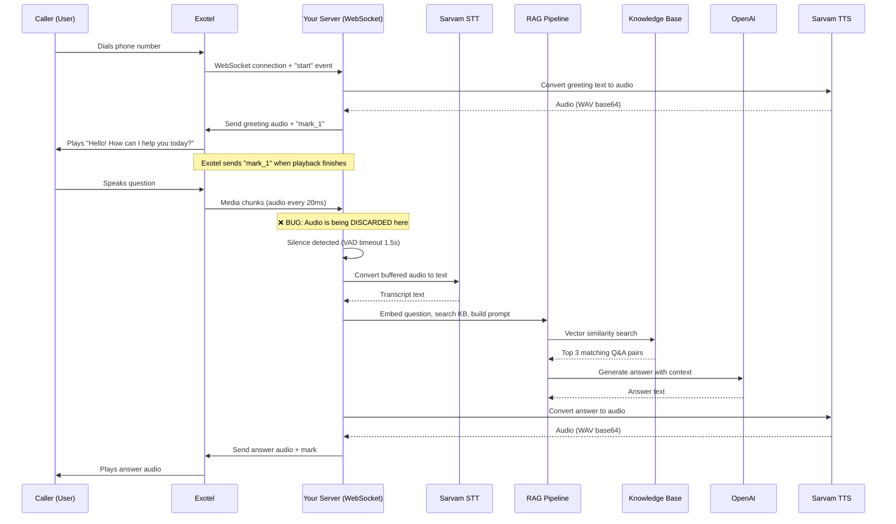

# 🔧 Convixx Exotel Voicebot — Complete Bug Analysis & Fix Guide

## Table of Contents
1. [Summary for Non-Technical Readers](#summary-for-non-technical-readers)
2. [How Your Voicebot System Works (Architecture)](#how-your-voicebot-system-works)
3. [What the Log File Tells Us](#what-the-log-file-tells-us)
4. [Root Cause Analysis](#root-cause-analysis)
5. [Detailed Code Fixes Required](#detailed-code-fixes-required)
6. [Testing Checklist](#testing-checklist)

---

## Summary for Non-Technical Readers

### What should happen:
1. User calls your phone number via **Exotel** (a cloud telephony provider)
2. System says **"Hello! How can I help you today?"** (✅ This works)
3. User speaks their question
4. System **converts user's voice to text** (STT — Speech To Text)
5. System **searches your knowledge base** (RAG — Retrieval Augmented Generation) for the answer
6. System **converts the answer back to voice** (TTS — Text To Speech)
7. User hears the answer on the phone

### What actually happens:
- Steps 1-2 work perfectly ✅
- Step 3 onwards — **the system receives user audio but THROWS IT AWAY** ❌
- The user speaks but the system never processes their words

### Why it breaks:
The system has a **"playback lock"** — while it's speaking (playing the greeting), it ignores user audio so it doesn't accidentally try to process its own voice. After the greeting finishes playing, Exotel is supposed to send a signal ("mark") saying *"I finished playing that audio"*. But there are **two bugs** that prevent the system from correctly unblocking:

> **Bug 1 (CRITICAL)**: Exotel sends the audio format's `sample_rate` as a text string `"8000"` but the code stores it directly. Later, when the code checks `session.mediaFormat.sample_rate` for audio calculations, it sometimes behaves unexpectedly because it's a string, not a number.

> **Bug 2 (CRITICAL — THE MAIN BLOCKER)**: After greeting audio is sent, the code adds `"mark_1"` to a "pending marks" list and sets `isSpeaking = true`. Exotel DOES send back `mark_1` (you can see it at line ~695 in your log). The code processes it and removes it from the pending list. **HOWEVER**, the `pendingMarks` set becomes empty and `isSpeaking` is set to `false` — but **the `vadTimer` (silence detector) was already cleared** when media arrived while the mark was pending. Since media keeps arriving every 20ms and the mark is processed *between* media messages, the VAD timer is caught in a race condition: it was cleared but a new one should have been started. **With the media arriving at 50 Hz (every 20ms) and the mark arriving in between**, the code's `break` statement on line 1087 (the `if (session.ttsInProgress || session.pendingMarks.size > 0)` check) keeps discarding audio **right up until** the mark is processed, but then immediately after, audio starts buffering — BUT the VAD timer that was cleared never gets restarted properly because the `clearTimeout(vadTimer)` on line 1086 fires for every media packet during playback.

Let me explain this more precisely in the technical section.

---

## How Your Voicebot System Works

### The Technology Stack

| Component | Technology | What it does |
|-----------|-----------|--------------|
| **Web Server** | Node.js + Fastify | Runs your backend API |
| **Phone System** | Exotel | Cloud telephony — connects phone calls to your server |
| **Connection** | WebSocket (WSS) | Real-time two-way connection between Exotel and your server |
| **Speech-to-Text** | Sarvam AI (saaras:v3) | Converts caller's voice into text |
| **AI Brain** | OpenAI (GPT-4o-mini) | Reads knowledge base context and generates answers |
| **Knowledge Base** | PostgreSQL + pgvector | Stores Q&A entries with vector embeddings for similarity search |
| **Text-to-Speech** | Sarvam AI (bulbul:v2) | Converts text answers back to voice audio |
| **Audio Format** | PCM 16-bit, 8kHz mono | Raw audio format used by Exotel telephony |

### The Call Flow (Step by Step)



### Key Concepts Explained

#### WebSocket
Think of it like an **open phone line between Exotel and your server**. Unlike normal web requests (one question, one answer), a WebSocket stays open for the entire call duration so data flows both ways continuously.

#### Exotel Media Chunks
Exotel sends the caller's audio as **tiny pieces (chunks)** — each is about 20 milliseconds of audio, arriving every 20ms. Your server collects these pieces like puzzle fragments.

#### VAD (Voice Activity Detection)
Your system uses **silence-based VAD** — it sets a timer (1.5 seconds). Every time a new audio chunk arrives, it resets the timer. When no new audio arrives for 1.5 seconds (the caller stopped speaking), the timer fires and triggers processing of all buffered audio.

#### Mark Events
When your server sends audio back to Exotel, it also sends a "mark" (like a bookmark). When Exotel finishes playing that audio to the caller, it sends the mark back. This tells your server: *"I'm done playing, you can start listening again."*

#### Pending Marks
`pendingMarks` is a **Set** (a collection of unique items). While there are pending marks, it means the system is still playing audio and should NOT process new caller audio (to avoid feedback loops).

---

## What the Log File Tells Us

### Timeline of Events (from the log)

| Time (ms since start) | Event | What happened |
|---|---|---|
| `0` | `start` | Exotel connects, sends call metadata. Sample rate: `"8000"` (string!), encoding: `"base64"` |
| `0` | `call.started` | Session created successfully |
| `0` | `call.session_ready` | Database records created |
| `0` | `greeting.sending` | Starting to generate greeting audio |
| `0` | `tts.start` | Calling Sarvam TTS with "Hello! How can I help you today?" |
| `0` | `pipeline.tts.response` | TTS returned 112,700 chars of base64 WAV |
| `0` | `pipeline.tts.resample` | Resampling from 22,050 Hz → 8,000 Hz |
| `0` | `exotel.out.media_batch` | Sent 5 media chunks (30,652 bytes of PCM) |
| `0` | `exotel.out.json` | Sent `mark_1` after the audio |
| `0` | `greeting.sent` | ✅ Greeting successfully sent |
| `+20ms...` | `exotel.in` media | Audio chunks keep arriving from caller (chunks 1-134) |
| `+~2.7s` | `exotel.in` **mark** | ✅ Exotel sends back `mark_1` — **playback finished!** |
| `+~2.7s...` | `exotel.in` media | Audio chunks continue (135, 136, 137... forever) |

### The Critical Observation

> [!IMPORTANT]
> After `mark_1` is received (line ~695 in the log, sequence 134), media chunks keep arriving but **NO processing stages are ever logged**. We never see:
> - `vad.timeout_triggered` ❌
> - `utterance.received` ❌
> - `pipeline.stt.request` ❌
> - `pipeline.rag.start` ❌
> 
> The log just shows media chunks arriving endlessly until the call ends. **The pipeline never triggers.**

### What the Exotel `start` message looks like:

```json
{
  "event": "start",
  "stream_sid": "a96749544f73ee386db308b7c6811a4f",
  "sequence_number": "1",
  "start": {
    "stream_sid": "a96749544f73ee386db308b7c6811a4f",
    "call_sid": "d91ee51111768cacafc4f2b158b11a4f",
    "account_sid": "convixxai1",
    "from": "07900002299",
    "to": "08037091588",
    "media_format": {
      "encoding": "base64",
      "sample_rate": "8000",          // ⚠️ STRING, not number!
      "bit_rate": "128kbps"           // ⚠️ STRING with unit!
    }
  }
}
```

---

## Root Cause Analysis

### Bug #1: `sample_rate` is stored as a string `"8000"` instead of number `8000`

> [!CAUTION]
> **Critical Data Type Bug**

**Where**: [exotel-voicebot.ts:998-999](file:///d:/Sandesh/Private/Convixx/nodejs_main/apps/api/src/routes/exotel-voicebot.ts#L998-L999)

The `ExotelMediaFormat` interface in [exotel-ws.ts:17](file:///d:/Sandesh/Private/Convixx/nodejs_main/apps/api/src/types/exotel-ws.ts#L17) defines:
```typescript
export interface ExotelMediaFormat {
  encoding: string;
  sample_rate: number;    // TypeScript SAYS number...
  ...
}
```

But Exotel sends `"8000"` (a **string**). TypeScript interfaces are compile-time only — at runtime, JavaScript doesn't enforce types. So `session.mediaFormat.sample_rate` ends up being the **string** `"8000"` instead of the **number** `8000`.

**Impact**: Multiple places do arithmetic with `sample_rate`:
- `pcmDurationMs()` — calculates how long audio will play
- `processUtterance()` — estimates utterance duration
- `createWavBuffer()` — writes WAV header sample rate
- `resamplePcm16()` — resamples audio

JavaScript string coercion makes `"8000"` *mostly* work in arithmetic (`"8000" * 2` → `16000`), but it can cause subtle bugs in `pcmDurationMs` and WAV header writing, and definitely causes incorrect type behavior.

### Bug #2: VAD Timer Race Condition (THE MAIN BLOCKER)

> [!CAUTION]
> **This is the primary bug that prevents user audio from being processed.**

**Where**: [exotel-voicebot.ts:1080-1132](file:///d:/Sandesh/Private/Convixx/nodejs_main/apps/api/src/routes/exotel-voicebot.ts#L1080-L1132)

Here's what happens step by step:

```
1. Greeting audio is sent → pendingMarks = {"mark_1"}, isSpeaking = true
2. Media chunk 1 arrives → pendingMarks.size > 0 → SKIP (vadTimer cleared)
3. Media chunk 2 arrives → pendingMarks.size > 0 → SKIP (vadTimer cleared)
   ...continues for chunks 1-133...
4. mark_1 arrives → pendingMarks.delete("mark_1") → pendingMarks.size = 0 → isSpeaking = false
5. Media chunk 134 arrives IMMEDIATELY after mark processing (same event loop tick or next ms)
```

**The problem at step 5**: When chunk 134 arrives, `pendingMarks.size === 0` and `ttsInProgress === false`, so the code *should* buffer it. Let's trace the code exactly:

```typescript
// Line 1085-1088
if (session.ttsInProgress || session.pendingMarks.size > 0) {
    if (vadTimer) clearTimeout(vadTimer);    // ← vadTimer is already null here
    break;                                    // ← EXIT without buffering
}
```

**Wait — at step 5, `pendingMarks.size` IS 0**, so this check should **pass through** to the buffering code below. So what's actually wrong?

After re-reading more carefully, the check does allow chunks through after mark_1 clears. But the **VAD timer never fires**. Here's why:

The VAD timer is supposed to fire after 1.5 seconds of silence (no new media). But **Exotel sends media chunks continuously at 50 Hz** — every 20ms, a new chunk arrives, even if the caller is silent. This is because **Exotel sends silence as audio too** (zero/near-zero samples). 

So the VAD timeout (1500ms) **can never fire** because every 20ms, a new chunk arrives and resets the timer!

> [!IMPORTANT]
> **THE REAL ROOT CAUSE**: The silence-based VAD timer is reset every 20ms because Exotel sends **continuous audio including silence**. The timer is set to 1500ms but never gets a chance to expire because audio chunks arrive every 20ms non-stop. The VAD timer approach is fundamentally incompatible with Exotel's continuous media streaming.

### Why the greeting works

The greeting doesn't rely on VAD. It's sent proactively as soon as the `start` event arrives — no user audio processing needed.

---

## Detailed Code Fixes Required

### Fix #1: Parse `sample_rate` as a number when creating the session

**File**: [exotel-voicebot.ts](file:///d:/Sandesh/Private/Convixx/nodejs_main/apps/api/src/routes/exotel-voicebot.ts)

**Where**: Inside the `case "start":` handler (~line 992-1001)

**Why**: Exotel sends `sample_rate` as `"8000"` (string). We must convert it to the number `8000` to ensure all audio math works correctly.

```diff
 session = createSession({
   streamSid: details.stream_sid,
   callSid: details.call_sid,
   customerId,
   accountSid: details.account_sid,
   from: details.from,
   to: details.to,
-  mediaFormat: details.media_format,
+  mediaFormat: {
+    ...details.media_format,
+    sample_rate: parseInt(String(details.media_format.sample_rate), 10) || 8000,
+  },
   customParameters: details.custom_parameters,
 });
```

**Simple explanation**: Before storing the audio format, we convert the `sample_rate` from text `"8000"` to number `8000`. If conversion fails, we default to `8000` (standard telephony rate).

---

### Fix #2: Implement Energy-Based VAD Instead of Silence-Timeout VAD

**File**: [exotel-voicebot.ts](file:///d:/Sandesh/Private/Convixx/nodejs_main/apps/api/src/routes/exotel-voicebot.ts)

**The problem**: The current VAD (Voice Activity Detection) relies on "no media chunk arriving for 1.5 seconds." But Exotel sends media chunks **continuously** — 50 per second — even when the caller is silent. So the timer resets every 20ms and never fires.

**The fix**: Instead of checking "did a media chunk arrive?", check **"did the audio chunk contain actual speech or just silence?"** by computing the **audio energy** (average loudness) of each chunk.

#### Sub-Fix 2A: Add an energy-detection helper

Add this function near the top of the file (after the constants section, ~line 72):

```typescript
/**
 * Compute RMS (root mean square) energy of a 16-bit LE PCM buffer.
 * Returns a value between 0 (silence) and 32768 (max volume).
 * Typical speech energy: 500-5000+; silence/noise: 0-200.
 */
function pcmRmsEnergy(pcm: Buffer): number {
  if (pcm.length < 2) return 0;
  const sampleCount = Math.floor(pcm.length / 2);
  let sumSq = 0;
  for (let i = 0; i < sampleCount; i++) {
    const sample = pcm.readInt16LE(i * 2);
    sumSq += sample * sample;
  }
  return Math.sqrt(sumSq / sampleCount);
}

/** Energy threshold: chunks below this are treated as silence.  
 *  Tune this value based on your environment — telephony is noisy,
 *  so 150-300 is a safe range. */
const VAD_ENERGY_THRESHOLD = 200;
```

**Simple explanation**: This function looks at the actual audio data and calculates how "loud" it is. Silent audio has energy near 0. Speech has energy typically above 200-500. By checking the energy, we can distinguish between "the caller is speaking" and "the caller is silent (but Exotel is still sending empty audio)."

#### Sub-Fix 2B: Change the media handler to use energy-based VAD

Replace the `case "media"` section (lines ~1064-1132) with:

```diff
 // ---- media (caller audio) ----
 case "media": {
   if (!session) {
     if (!sawMediaBeforeStart) {
       sawMediaBeforeStart = true;
       log?.warn(
         {
           customerId,
           stream_sid: (msg as ExotelMediaMessage).stream_sid,
         },
         "voicebot received media before start; cannot process/greet until start event arrives"
       );
     }
     break;
   }

   const mediaMsg = msg as ExotelMediaMessage;
   const pcm = decodeBase64Pcm(mediaMsg.media.payload);

   // While agent audio is generating or Exotel has not yet ack'd playback via `mark`,
   // do not buffer inbound for STT/VAD and do not send `clear` — playback ends only when marks complete.
   if (session.ttsInProgress || session.pendingMarks.size > 0) {
-    if (vadTimer) clearTimeout(vadTimer);
+    // Discard caller audio during playback — don't buffer or set VAD timers
     break;
   }

+  // --- Energy-based VAD ---
+  const energy = pcmRmsEnergy(pcm);
+  const isSpeech = energy > VAD_ENERGY_THRESHOLD;
+
   // Accumulate inbound PCM
-  session.inboundPcm.push(pcm);
-  session.inboundBytes += pcm.length;
+  if (isSpeech || session.inboundPcm.length > 0) {
+    // Buffer audio if it's speech, or if we're already mid-utterance
+    // (captures silence gaps within speech)
+    session.inboundPcm.push(pcm);
+    session.inboundBytes += pcm.length;
+  }

   // Reset VAD silence timer
   if (vadTimer) clearTimeout(vadTimer);

+  // Only start the silence timer if we have buffered audio
+  // (i.e., the caller started speaking and we're waiting for them to stop)
+  if (session.inboundPcm.length === 0) {
+    break; // Pure silence, nothing buffered — just wait
+  }
+
   // Safety: if buffer is too large, force-process
   if (session.inboundBytes >= MAX_INBOUND_BUFFER_BYTES) {
     if (!isProcessing) {
       isProcessing = true;
       try {
         await processUtterance(socket, session, log);
       } catch (err) {
         log.error({ err }, "voicebot: utterance processing error");
       } finally {
         isProcessing = false;
       }
     }
     break;
   }

   // Start silence timer — when silence detected, process utterance
   vadTimer = setTimeout(async () => {
     if (!session || session.isClosing || isProcessing) return;
     if (session.inboundPcm.length === 0) return;
     logVoiceStage(log, "vad.timeout_triggered", {
       customerId: session.customerId,
       stream_sid: session.streamSid,
       buffered_chunks: session.inboundPcm.length,
       buffered_bytes: session.inboundBytes,
     });

     isProcessing = true;
     try {
       await processUtterance(socket, session, log);
     } catch (err) {
       log.error({ err }, "voicebot: utterance processing error");
     } finally {
       isProcessing = false;
     }
   }, VAD_SILENCE_TIMEOUT_MS);
   break;
 }
```

**Simple explanation**: 

Before this fix: *"Reset the timer whenever ANY audio arrives"* → Timer never fires because audio arrives every 20ms.

After this fix: 
1. Check if the audio chunk contains actual speech (energy > threshold)
2. Only start buffering when speech is detected  
3. Once speech buffering starts, **start the silence timer** — the timer fires after 1.5 seconds of **only low-energy (silent) chunks**, meaning the caller stopped speaking
4. When only silent chunks are coming in AND we have buffered speech audio, the timer fires and processing begins

> [!TIP]
> The key insight: With energy-based VAD, the silence timer still resets every 20ms when receiving **silent** chunks, but we **don't buffer** silent chunks if no speech has been detected yet. Once speech IS detected and we start buffering, the timer purpose changes — it now fires after 1.5 seconds where **all** received chunks are silence (which means the caller stopped talking).

**Wait — that still has the same problem!** Let me revise. The timer still resets on every chunk. The fix needs a different approach:

#### Revised Sub-Fix 2B: Track speech state properly

```typescript
// ---- media (caller audio) ----
case "media": {
  if (!session) {
    if (!sawMediaBeforeStart) {
      sawMediaBeforeStart = true;
      log?.warn(
        {
          customerId,
          stream_sid: (msg as ExotelMediaMessage).stream_sid,
        },
        "voicebot received media before start; cannot process/greet until start event arrives"
      );
    }
    break;
  }

  const mediaMsg = msg as ExotelMediaMessage;
  const pcm = decodeBase64Pcm(mediaMsg.media.payload);

  // While agent audio is generating or Exotel has not yet ack'd playback via `mark`,
  // do not buffer inbound for STT/VAD
  if (session.ttsInProgress || session.pendingMarks.size > 0) {
    break;
  }

  // --- Energy-based VAD ---
  const energy = pcmRmsEnergy(pcm);
  const isSpeech = energy > VAD_ENERGY_THRESHOLD;

  if (isSpeech) {
    // Caller is speaking — buffer this chunk
    session.inboundPcm.push(pcm);
    session.inboundBytes += pcm.length;

    // Reset/clear the silence timer — caller is still talking
    if (vadTimer) {
      clearTimeout(vadTimer);
      vadTimer = null;
    }
  } else if (session.inboundPcm.length > 0) {
    // Caller was speaking but this chunk is silent — 
    // they may have paused or stopped. 
    // Still buffer it (captures natural speech pauses).
    session.inboundPcm.push(pcm);
    session.inboundBytes += pcm.length;

    // Start/keep the silence timer — if silence continues for 
    // VAD_SILENCE_TIMEOUT_MS, treat it as end of utterance
    if (!vadTimer) {
      vadTimer = setTimeout(async () => {
        vadTimer = null;
        if (!session || session.isClosing || isProcessing) return;
        if (session.inboundPcm.length === 0) return;
        logVoiceStage(log, "vad.timeout_triggered", {
          customerId: session.customerId,
          stream_sid: session.streamSid,
          buffered_chunks: session.inboundPcm.length,
          buffered_bytes: session.inboundBytes,
        });

        isProcessing = true;
        try {
          await processUtterance(socket, session, log);
        } catch (err) {
          log.error({ err }, "voicebot: utterance processing error");
        } finally {
          isProcessing = false;
        }
      }, VAD_SILENCE_TIMEOUT_MS);
    }
    // note: do NOT reset the timer on subsequent silence chunks —
    // let it count down from when silence first began
  }
  // else: silence and no buffered speech — ignore (caller hasn't spoken yet)

  // Safety: if buffer is too large, force-process
  if (session.inboundBytes >= MAX_INBOUND_BUFFER_BYTES) {
    if (vadTimer) { clearTimeout(vadTimer); vadTimer = null; }
    if (!isProcessing) {
      isProcessing = true;
      try {
        await processUtterance(socket, session, log);
      } catch (err) {
        log.error({ err }, "voicebot: utterance processing error");
      } finally {
        isProcessing = false;
      }
    }
  }
  break;
}
```

**How this works (in simple terms)**:

| Caller State | Audio Energy | Buffer Has Data? | Action |
|---|---|---|---|
| Silent (hasn't spoken yet) | Low | No | Ignore chunk, wait |
| Speaking | High | Yes (or starts now) | Buffer chunk, cancel silence timer |
| Paused mid-sentence | Low | Yes | Buffer chunk, START silence timer (1.5s countdown) |
| Paused mid-sentence (timer running) | Low | Yes | Buffer chunk, let timer keep counting |
| Silence timer fires | — | Yes | **PROCESS! → STT → RAG → TTS** |
| Resumes speaking (timer was running) | High | Yes | Buffer chunk, CANCEL silence timer |

This correctly handles the key scenario:
- Caller says *"What are your business hours?"* → high energy chunks get buffered, timer stays cancelled
- Caller stops speaking → low energy chunks arrive, timer starts
- After 1.5 seconds of low-energy audio → timer fires → STT runs → RAG answers → TTS speaks

---

### Fix #3: Clear inbound buffer after mark is acknowledged

**File**: [exotel-voicebot.ts](file:///d:/Sandesh/Private/Convixx/nodejs_main/apps/api/src/routes/exotel-voicebot.ts)

**Where**: Inside the `case "mark":` handler (~line 1145-1156)

**Why**: Any audio that arrived during playback was discarded (good), but there might be stale fragments from before + after the mark transition. Clearing the buffer on mark acknowledgment ensures a clean start.

```diff
 // ---- mark ----
 case "mark": {
   if (!session) break;
   const markName = (msg as any).mark?.name;
   if (markName) {
     session.pendingMarks.delete(markName);
     if (session.pendingMarks.size === 0) {
       session.isSpeaking = false;
       clearPlaybackMarkFallback(session);
+      // Clear any audio buffered during playback — it's echo/crosstalk
+      session.inboundPcm = [];
+      session.inboundBytes = 0;
+      log?.info({
+        stream_sid: session.streamSid,
+        mark: markName,
+      }, "voicebot: playback complete, cleared inbound buffer, ready for caller speech");
     }
   }
   break;
 }
```

**Simple explanation**: When the system confirms its greeting finished playing, it throws away any audio that was captured during playback (which would just be echo of its own voice or noise) and starts fresh, ready to listen to the caller.

---

### Fix #4: Add the `pcmRmsEnergy` function and constant

**File**: [exotel-voicebot.ts](file:///d:/Sandesh/Private/Convixx/nodejs_main/apps/api/src/routes/exotel-voicebot.ts)

**Where**: After line 72 (after `const GREETING_TEXT = ...`)

```typescript
/** Energy threshold for voice activity detection.
 *  PCM chunks with RMS energy below this are treated as silence.
 *  Telephony audio (8kHz) typically has noise floor ~50-150.
 *  Speech is typically 300-5000+. Start with 200 and tune if needed. */
const VAD_ENERGY_THRESHOLD = 200;

/**
 * Compute RMS (root mean square) energy of a 16-bit LE PCM buffer.
 * Returns 0 for empty buffers. Speech typically > 300, silence < 150.
 */
function pcmRmsEnergy(pcm: Buffer): number {
  const sampleCount = Math.floor(pcm.length / 2);
  if (sampleCount === 0) return 0;
  let sumSq = 0;
  for (let i = 0; i < sampleCount; i++) {
    const sample = pcm.readInt16LE(i * 2);
    sumSq += sample * sample;
  }
  return Math.sqrt(sumSq / sampleCount);
}
```

---

## Testing Checklist

After applying all fixes, test with the following scenarios:

### Test 1: Basic Greeting
- [ ] Call the voicebot number
- [ ] Hear "Hello! How can I help you today?" clearly
- [ ] Log shows: `greeting.sending` → `tts.start` → `tts.sent_to_exotel` → `greeting.sent`

### Test 2: First User Question
- [ ] After greeting, speak a question clearly
- [ ] Log should show (in order):
  - `vad.timeout_triggered` — silence detector fires after you stop speaking
  - `utterance.received` — audio buffer is collected  
  - `pipeline.stt.request` → `pipeline.stt.response` — speech converted to text
  - `pipeline.rag.start` → `pipeline.rag.kb_hit` → `pipeline.rag.llm_request` — RAG lookup
  - `tts.start` → `tts.sent_to_exotel` — answer audio sent back
- [ ] Hear the answer spoken back to you

### Test 3: Follow-up Question
- [ ] After hearing the answer, ask another question
- [ ] The same pipeline should trigger again
- [ ] Chat history should include the previous turn

### Test 4: Silence Handling
- [ ] Stay silent after the greeting
- [ ] System should NOT trigger any processing (no `vad.timeout_triggered`)
- [ ] No error audio should play

### Test 5: Energy Threshold Tuning
If the system doesn't respond:
- [ ] Temporarily add logging: `log.info({ energy }, "voicebot: media energy")`
- [ ] Check what energy values you see for speech vs. silence
- [ ] Adjust `VAD_ENERGY_THRESHOLD` accordingly (lower = more sensitive, higher = less sensitive)

> [!WARNING]
> The `VAD_ENERGY_THRESHOLD` value of `200` is a starting point. You may need to adjust it:
> - **If the system never responds** → Lower to 100 or 50
> - **If the system responds to background noise** → Raise to 300 or 500
> - **To debug**, temporarily add: `log.info({ energy, isSpeech: energy > VAD_ENERGY_THRESHOLD })` in the media handler

---

## Summary of All Changes

| Fix # | File | What | Why |
|-------|------|------|-----|
| 1 | `exotel-voicebot.ts` (line ~998) | Parse `sample_rate` as integer | Exotel sends string `"8000"`, code expects number |
| 2A | `exotel-voicebot.ts` (new function) | Add `pcmRmsEnergy()` function | Needed for energy-based voice detection |
| 2B | `exotel-voicebot.ts` (media handler) | Rewrite VAD logic | Old timeout-based VAD can't work with continuous media streams |
| 3 | `exotel-voicebot.ts` (mark handler) | Clear buffer on mark ack | Prevent echo/stale audio from triggering false STT |

> [!TIP]
> **Deployment note**: These changes are all in one file (`apps/api/src/routes/exotel-voicebot.ts`). After making changes:
> 1. Build: `npm run build` (or `tsc`)
> 2. Restart the process (PM2: `pm2 restart convixx-ai-main`)
> 3. Make a test call and watch the logs
