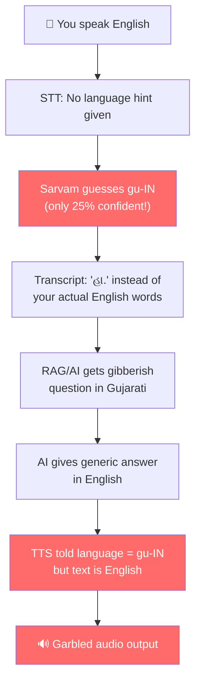
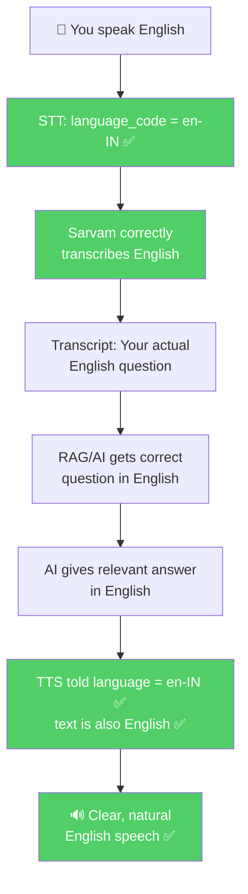

# 🔧 Convixx Voicebot — Language Fix Guide (TEMPORARY)

> [!IMPORTANT]
> All fixes in this document are **TEMPORARY** — controlled by a single env flag `VOICEBOT_MULTILINGUAL`.
> When set to `false` (default), the system runs in **English-only mode**.
> When ready for all Indian languages, simply set `VOICEBOT_MULTILINGUAL=true` in `.env`.

---

## Table of Contents
1. [Summary for Non-Technical Readers](#summary-for-non-technical-readers)
2. [What's Going Wrong (3 Problems)](#whats-going-wrong)
3. [Root Cause Analysis](#root-cause-analysis)
4. [The VOICEBOT_MULTILINGUAL Flag](#the-voicebot_multilingual-flag)
5. [Code Changes Made](#code-changes-made)
6. [How to Re-enable Multilingual Support](#how-to-re-enable-multilingual-support)
7. [Testing Steps](#testing-steps)

---

## Summary for Non-Technical Readers

Imagine you're calling a customer service bot. You say "Hello" in English. But the bot hears your English words and **thinks you're speaking Gujarati** — so it writes down Gujarati text. Then it sends that Gujarati text to the "brain" (AI), which gets confused because the question is gibberish. The brain gives a weird answer. Then that answer gets converted to speech **in Gujarati** — so you hear something that sounds like nonsense.

That's exactly what's happening in your voicebot right now:

```
You speak:        "Hello" (in English)
                     ↓
STT hears:        "હા." (Gujarati for "Yes" — WRONG!)
STT detects:      language = "gu-IN" (Gujarati)
                     ↓
RAG/AI gets:      question = "હા." (3 characters of Gujarati)
AI answers:       "How can I assist you with your stay or activities?"
                     ↓
TTS language:     "gu-IN" (Gujarati!) — because STT said the language was Gujarati
TTS converts:     English text → Gujarati pronunciation = GARBLED AUDIO! 💥
                     ↓
You hear:         "_ _ something" (unintelligible gibberish)
```

**The fix:** We added a simple ON/OFF switch (`VOICEBOT_MULTILINGUAL`). When OFF (default), everything is forced to English — which is what you need right now. When you're ready for Hindi, Gujarati, Tamil etc. in the future, just flip this switch to ON.

---

## What's Going Wrong

### Three Interconnected Problems

| # | Symptom You Experience | Root Cause |
|---|------------------------|------------|
| **1** | English speech gets transcribed as Gujarati | STT has no `language_code` hint → auto-detects wrong language |
| **2** | Answer doesn't make sense | Wrong transcript ("હા." instead of real English words) sent to AI |
| **3** | Voice sounds like "_ _" or garbled | English AI answer fed to TTS with `gu-IN` language → garbled audio |

---

## Root Cause Analysis

### Evidence from Log

```
Line 1888: pipeline.stt.request → wav_pcm_bytes: 24960, sample_rate: 8000
Line 1901: stt.done → language: "gu-IN", transcript_chars: 3
Line 1902: pipeline.stt.response → transcript: "હા.", language_code: "gu-IN", language_probability: 0.25
```

**Key:** `language_probability: 0.25` — Sarvam is only **25% confident** this is Gujarati. It's guessing on low-quality 8kHz phone audio.

### The Domino Effect



**After the fix (VOICEBOT_MULTILINGUAL=false):**



---

## The VOICEBOT_MULTILINGUAL Flag

### What It Does

| Flag Value | Behavior | When to Use |
|------------|----------|-------------|
| `false` (default) | **English-only**: STT forced to `en-IN`, TTS always English, LLM instructed to respond in English | **NOW** — until multi-language is properly tested |
| `true` | **All languages**: STT auto-detects language, TTS follows detected language, LLM has no language restriction | **FUTURE** — when ready for all Indian languages |

### Where It Lives

**File:** `apps/api/src/config/env.ts`

```typescript
/**
 * VOICEBOT MULTILINGUAL SUPPORT (TEMPORARY: English-only by default)
 *
 * When `false` (default): STT is forced to English, TTS always uses English.
 * When `true`: STT auto-detects language, TTS follows detected language.
 *
 * Set VOICEBOT_MULTILINGUAL=true in .env when ready for all Indian languages.
 */
voicebotMultilingual: process.env.VOICEBOT_MULTILINGUAL === "true",
```

### How to Toggle

Add this line to your `.env` file:

```bash
# English-only mode (default — no need to add this line)
VOICEBOT_MULTILINGUAL=false

# OR: Enable all Indian languages (future)
VOICEBOT_MULTILINGUAL=true
```

---

## Code Changes Made

### Files Modified

| File | What Changed |
|------|--------------|
| `apps/api/src/config/env.ts` | Added `voicebotMultilingual` env flag |
| `apps/api/src/routes/exotel-voicebot.ts` | 3 changes: STT, TTS, and RAG prompt |

### Change 1: STT — Force English Transcription

**File:** [exotel-voicebot.ts](file:///d:/Sandesh/Private/Convixx/nodejs_main/apps/api/src/routes/exotel-voicebot.ts#L562-L582)

```diff
+    // ──────────────────────────────────────────────────────────────
+    // TEMPORARY FIX: Force English STT when VOICEBOT_MULTILINGUAL=false (default).
+    // Sarvam auto-detection on 8kHz telephony audio is unreliable (misdetects
+    // English as Gujarati/other languages with <25% confidence).
+    //
+    // TODO: When ready for all Indian languages, set VOICEBOT_MULTILINGUAL=true
+    // in .env — this will remove the language_code hint and let Sarvam auto-detect.
+    // ──────────────────────────────────────────────────────────────
+    const sttLanguageHint = env.voicebotMultilingual
+      ? undefined          // Multi-language: let Sarvam auto-detect
+      : "en-IN";           // English-only: force English transcription
+
     const stt = await sarvamSpeechToText({
       fileBuffer: wavBuffer,
       filename: "utterance.wav",
       mimeType: "audio/wav",
       model: "saaras:v3",
       mode: "transcribe",
+      language_code: sttLanguageHint,
     });
```

### Change 2: TTS — Force English Voice Output

**File:** [exotel-voicebot.ts](file:///d:/Sandesh/Private/Convixx/nodejs_main/apps/api/src/routes/exotel-voicebot.ts#L667-L677)

```diff
     // === Step 3: TTS + Send ===
-    const ttsLanguage = mapToTtsLanguage(detectedLanguage);
+    // ──────────────────────────────────────────────────────────────
+    // TEMPORARY FIX: Force English TTS when VOICEBOT_MULTILINGUAL=false (default).
+    // When STT misdetects the language (e.g. gu-IN for English speech),
+    // TTS receives English text with wrong language code → garbled audio.
+    //
+    // TODO: When VOICEBOT_MULTILINGUAL=true, the old mapToTtsLanguage()
+    // will be used again so TTS follows the STT-detected language.
+    // ──────────────────────────────────────────────────────────────
+    const ttsLanguage = env.voicebotMultilingual
+      ? mapToTtsLanguage(detectedLanguage)   // Multi-language: follow STT detection
+      : "en-IN";                              // English-only: always English TTS
     await speakToExotel(ws, session, askResult.answer, ttsLanguage, log);
```

### Change 3: RAG — English Response Instruction

**File:** [exotel-voicebot.ts](file:///d:/Sandesh/Private/Convixx/nodejs_main/apps/api/src/routes/exotel-voicebot.ts#L840-L852)

```diff
     // Build RAG prompt
+    // ──────────────────────────────────────────────────────────────
+    // TEMPORARY FIX: When VOICEBOT_MULTILINGUAL=false, add English-only
+    // instruction so LLM never responds in a non-English language.
+    // TODO: Remove the English-only rule when multilingual is enabled.
+    // ──────────────────────────────────────────────────────────────
+    const languageRule = env.voicebotMultilingual
+      ? ""                                        // Multi-language: no restriction
+      : "\n- ALWAYS respond in English.";          // English-only
     const ragRules = `--- RAG rules ---
 - Answer using ONLY information from the KNOWLEDGEBASE below.
 - Keep answers SHORT and conversational — suitable for voice/phone.
 - Avoid bullet points and complex formatting; speak naturally.
-- Use ANSWER_NOT_FOUND only when no passage answers the question.`;
+- Use ANSWER_NOT_FOUND only when no passage answers the question.${languageRule}`;
```

### Change 4: Env Config — New Flag

**File:** [env.ts](file:///d:/Sandesh/Private/Convixx/nodejs_main/apps/api/src/config/env.ts#L62-L72)

```diff
   },

+  /**
+   * VOICEBOT MULTILINGUAL SUPPORT (TEMPORARY: English-only by default)
+   *
+   * When `false` (default): STT forced to English, TTS always English.
+   * When `true`: STT auto-detects, TTS follows detected language.
+   *
+   * Set VOICEBOT_MULTILINGUAL=true in .env when ready for all Indian languages.
+   */
+  voicebotMultilingual: process.env.VOICEBOT_MULTILINGUAL === "true",
+
   /** Set to `false` to disable verbose RAG pipeline logs */
   logRagTrace: process.env.LOG_RAG_TRACE !== "false",
```

---

## How to Re-enable Multilingual Support

When you're ready to support all Indian languages (Hindi, Gujarati, Tamil, etc.):

### Step 1: Update `.env`
```bash
VOICEBOT_MULTILINGUAL=true
```

### Step 2: Restart the Server
The code will automatically:
- ✅ Remove the `language_code` hint from STT (let Sarvam auto-detect)
- ✅ Use `mapToTtsLanguage()` to match TTS to detected language
- ✅ Remove the "respond in English" LLM instruction

### Step 3: Test with Multiple Languages
Before going live, test with:
- English calls
- Hindi calls
- Any other target language

### Important Notes for Future Multilingual
> [!WARNING]
> When re-enabling multilingual, you should also:
> 1. **Improve STT confidence checking** — Only trust auto-detected language when `language_probability > 0.7`. If confidence is low, fall back to English.
> 2. **Ensure KB has multilingual content** — The knowledge base answers are likely in English. If a user speaks Hindi, the LLM response will be English but TTS will try to read it in Hindi. You may need the LLM to translate its answer to match the detected language.
> 3. **Test on 8kHz audio** — Sarvam's language detection is less reliable on compressed telephone audio. Test thoroughly.

---

## Testing Steps

### After Deploying These Fixes

1. **Make a test call** to the Exotel number
2. **Wait for greeting** ("Hello! How can I help you today?")
3. **Speak English** clearly (e.g., "What are your room rates?")
4. **Verify** the response is clear, natural English — not garbled

### What to Check in Logs

| Log Entry | Expected Value |
|-----------|----------------|
| `stt.done → language` | `"en-IN"` |
| `pipeline.stt.response → transcript` | Your actual English words |
| `pipeline.rag.llm_response → answer_preview` | Relevant answer |
| `tts.start → languageCode` | `"en-IN"` |
